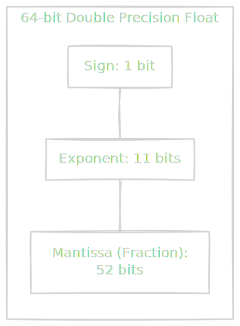
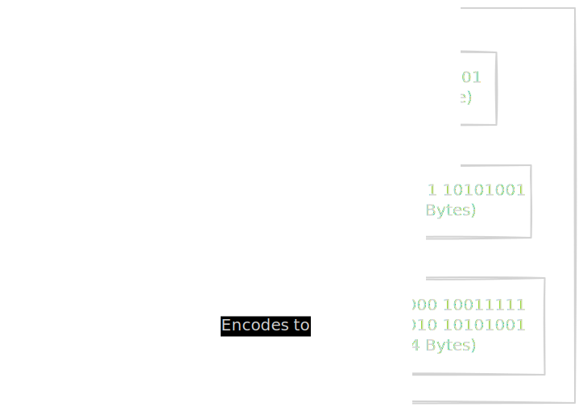

We have established that the computer is a rock we tricked into thinking, and we have discussed the mechanics of the disk where it stores its memories. Now, we must ask: **What do those memories look like?**

When you write `x = 10` or `name = 'Andrew'`, you are writing in a high-level hallucination. Down to the metal, there are no numbers, no letters, and certainly no JSON. There is only voltage. High voltage (1) and low voltage (0).

This module is about the translation layer: how we turn a stream of 1s and 0s into the rich data types we use every day.

## 4.1 Integers and Floats
Let's start with the basics. How do we count?

### Integers: The Easy Part
Storing positive integers (0, 1, 2, 3, 4, …) is straightforward. We use **binary** (Base 2).

- `0` $\to$ `0000`
- `1` $\to$ `0001`
- `2` $\to$ `0010`
- `3` $\to$ `0011`

But what about negative numbers? This is where things get clever. The computer engineers of the past realized they didn't want to build a separate "subtraction circuit." They wanted to use the "addition circuit" to do subtraction.

Enter **two's complement**.

To make a number negative in binary:

1. Flip all the bits (0's become 1, 1 becomes 0).
2. Add 1.

Why go through this trouble? Because it makes the math work automatically. If you add `5` and `-5` (in Two's Complement), the binary addition naturally overflows `0`.

!!! note "The Integer Overflow"

    In a standard 32-bit signed integer, the first bit is the "sign bit." This leaves 31 bits for the number itself.

    **Max Value**: $2^{31} - 1 = 2,147,483,647$.

    If you have `2,147,483,647` and you add `1`, you flip the sign bit. The number wraps around to `-2,147,483,648`. This is the classic "Integer Overflow" bug (and why the Gangnam Style YouTube counter broke the internet years ago. If you didn't know, Google it. It's fascinating.)

### Floating-Point: The Dangerous Part
Now, how do we store `3.14`?

You might we just split the bits: "16 bits for the 3, and 16 bits for the .14". This is called **Fixed Point**, and it's rare because it limits the range of numbers you can represent. 

Instead, we use **Floating-Point** (IEEE 754). It is essentially scientific notation for binary. Recall scientific notation: $1.23 \times 10^4$. IEEE 754 does the same: $1.\text{mantissa } \times 2^{\text{exponent}$.

A 64-bit Float (Double) is split into three parts:

1. **Sign (1 bit)**: Positive or negative.
2. **Exponent (11 bits)**: How far to move the decimal point (the "magnitude").
3. **Mantissa (52 bits)**: The actual precision digits.



### The Precision Trap
Here is the problem: **0.1 cannot be represented in binary**.

In Base 10 (the human number system), $\frac{1}{3}$ is $0.333333…$ (repeating forever). In Base 2, $\frac{1}{10}$ is $0.00011001100110011…$ (repeating forever).

Because we only have 52 bits of Mantissa, we have to chop off the infinite series. We lose precision. The computer doesn't store "0.1". It stores "0.10000000000000000055115…".

This leads to the most famous absurdity in computer science (which you can try out on your end to verify, if you know Python):

```python
>>> 0.1 + 0.2
0.30000000000000004
```

!!! tip "Data Engineering Context: Never Use Floats for Money"

    This is the cardinal rule of data engineering. **Never, ever store currency as float**.

    If you are calculating bank balances and you use Floats, those tiny precision errors (`0.000000004`) will accumulate over millions of transactions. Eventually, you will lose pennies, and your finance team will hunt you down.

    **The Solution:**

    1.  **Use Decimals:** Databases (Postgres/BigQuery) have a `DECIMAL` or `NUMERIC` type that stores numbers as exact base-10 strings, not binary approximations.
    2.  **Use Integers:** Store everything in "cents" (or "micros"). Store `$10.50` as the integer `1050`.

## 4.2 Text Encoding
If storing numbers is tricky, storing text is a nightmare.

Computers deal in numbers. To store the letter 'A', we have to agree that the number `65` stands for 'A'. This agreement is called an **Encoding**.

For decades, this was the Wild West. Different countries created different maps. If you opened a file saved in Russia on a computer in France, it would look like gibberish because the number `200` meant "Cyrillic D" in one map and "Accented E" in another.

### The Old Guard: ASCII
In the beginning, there was **ASCII** (American Standard Code for Information Interchange).

ASCII was simple. It used **7 bits**, giving us 128 possibilities (0-127).

- `65` = 'A'
- `97` = 'a'
- `32` = Space

It contained English letters, numbers, and some control characters (like "Bell" or "Carriage Return"). It was perfect, assuming you only ever wanted to write in English. It failed miserably for the rest of the world.

### The Messiah: Unicode & UTF-8
Eventually, the industry got together and said, "We need one giant map for every character in human history."

This is **Unicode**. Unicode is just a theoretical list. It says, "The 'Pile of Poo' emoji (💩) is at index `U+1F4A9`."

But Unicode doesn't tell you how to save that to disk. It's just the index. You still need an encoding scheme to turn that index number into binary bytes.

Enter **UTF-8**.

UTF-8 is the dominant encoding of the web and modern data engineering. It is brilliant because it is **Variable Length**.

- **1 Byte**: Standard English characters (A, B, C) look exactly like ASCII. This preserves backward compatibility.
- **2 Bytes**: European characters with accents (é, ü).
- **3 Bytes**: Most Asian characters (Chinese, Japanese).
- **4 Bytes**: Emojis and obscure symbols.

This is why `len("💩")` often returns confusing results in older programming languages—they might be counting bytes (4) instead of characters (1).



!!! tip "Data Engineering Context: The 'Garbled Characters' Bug"

    You ingest a CSV file from a partner, and half the names look like José $\to$ José. This is a classic **Mojibake** (Japanese for "character transformation").

    **What happened:**

    1. The partner saved the file as **UTF-8**. In UTF-8, 'é' is two bytes: `C3 A9`.
    2. Your system opened it thinking it was **Windows-1252** (an old standard).
    3. In Windows-1252, `C3` maps to 'Ã' and `A9` maps to '©'.

    **The Fix:** Explicitly set your encoding when reading files. In Python: `pd.read_csv('file.csv', encoding='utf-8')`. Never assume the default is correct.

### The Byte Order Mark (BOM)
Sometimes you will open a file and see strange invisible characters at the very start (like `\ufeff`). This is the **BOM**.

It's a "magic handshake" that some programs (like Microsoft Excel) put at the start of a text file to scream, "Hello! I am UTF-8!"

However, most modern data tools (like Spark or Pandas) hate the BOM. They treat it as part of the first column header.

- Expected Header: `id`
- Actual Header: `\ufeffid`

This causes your pipeline to fail with `Column 'id' not found`. Always check for the BOM if your headers look right but the code says they are wrong.

## 4.3 Serialization Formats
We have learned how to store a single number and a single character. But data doesn't come in single characters; it comes in objects, rows, events, and records. We need a way to glue those primitive types together into a coherent package.

This is **Serialization**: turning a complex object in memory (like a Python Dictionary or Java Class) into a stream of bytes that can be sent over a wire or saved to a disk.

In data engineering, this choice—"How do we package the data?"—is often the difference between a pipeline that finishes in 10 minutes and one that takes 10 hours.

### The Great Divide: Text vs. Binary
There are essentially two religions in serialization: Text (human-readable) and Binary (machine-optimized).

#### 1. Text Formats (JSON, CSV, XML)
These are the "friendly" formats. You often open them in notepad and read them.

- **Pros**: Easy to debug. Ubiquitous.
- **Cons**: **Bloated and slow**.

Consider this JSON object:

```json
{
  "user_id": 1045,
  "action": "click",
  "timestamp": 1678886400
}
```

Every time you save a record, you are saving the strings `"user_id"`, `"action"`, and `"timestamp"`. If you have 1 billion records, you are saving the string `"user_id"` 1 billion times. That is Gigabytes of wasted space just repeating the column names.

Furthermore, the computer has to *parse* this. It has to scan the string, look for `{`, look for `"`, look for `:`, and convert the string `"1045"` back into the integer `1045`. This burns CPU cycles like crazy.

#### 2. Binary Formats (Avro, Protobuf, Parquet)
These are the "efficient" formats. If you open them in Notepad, they are gibberish.

- **Pros**: Compact (compression). Fast (zero-copy parsing). Types are preserved.
- **Cons**: You need a special viewer or code to read them.

Binary formats strip out the fluff. They don't repeat the field names in every record. Instead, they say, "The first 4 bytes are the ID. The next 1 byte is the Action Enum."


### The Schema Contract
Binary formats usually require a **Schema**—a separate document that defines the structure.

- **Writer**: "I promise to write data according to Schema X."
- **Reader**: "I have Schema X, so I know how to decode this blob."

**Apache Avro** is the king of row-based binary formats in data engineering (often used with Kafka). An Avro file effectively has two parts:

1. **The Header**: Contains the Schema (JSON format).
2. **The Body**: The binary data blocks.

This means the schema travels *with* the data.

!!! tip "Data Engineering Context: Schema Evolution"

    The hardest problem in pipelines is **change**. What happens when the upstream team adds a new field `email_address` to the data, but your downstream consumer code doesn't know about it yet?

    - **CSV/JSON:** Often breaks. "Index out of bounds" or "KeyError".
    - **Avro/Protobuf:** Designed for **Schema Evolution**.

    Avro allows you to define "default values." If the reader sees a new field it doesn't recognize, it can skip it. If the reader *expects* a field that is missing, it fills in the default. This allows the Producer and Consumer to upgrade their code at different times without taking down the pipeline.

### Row vs. Columnar (A Preview)
While Avro and Protobuf are great for *rows* (sending one event at a time), they are not the best for *analytics*.

If you want to calculate the `average(age)` of 1 million users:

- **Row Format (Avro/JSON)**: You have to read every single user's entire object (Name, Address, Photo, Age) just to get the Age.
- **Columnar Format (Parquet)**: We will cover this deep dive later, but essentially, it groups all the "Ages" together physically. You can read only the ages and ignore the rest.

## Quiz

<quiz>
In a 32-bit signed integer using Two's Complement, what happens if you add 1 to the maximum possible value (2,147,483,647)?
- [ ] It becomes 2,147,483,648 (the capacity automatically expands).
- [ ] It resets to 0.
- [x] It wraps around to -2,147,483,648 (integer overflow).
- [ ] The computer throws a hardware error and stops the CPU.

</quiz>

<quiz>
Why does `0.1 + 0.2` often equal `0.300000000000004` in programming languages?
- [ ] Because the OS Scheduler interrupted the calculation.
- [ ] Because the computer's CPU is damaged or overheating.
- [ ] Because the programming language is using a low-precision integer type.
- [x] Because 0.1 is an infinite repeating fraction in binary, causing precision loss when stored in finite bits.

</quiz>

<quiz>
What is the primary reason you should never store currency (money) as a Floating-Point number?
- [ ] Floats cannot represent negative balances.
- [x] Tiny precision errors accumulate over time, leading to missing money.
- [ ] Databases do not support sorting on Floating-Point columns.
- [ ] Floats take up too much memory compared to integers

</quiz>

<quiz>
Which of the following best describes UTF-8 encoding?
- [x] Variable-Length: Standard characters use 1 byte, while complex symbols can use up to 4 bytes.
- [ ] 7-bit Only: It is identical to ASCII and cannot store Emojis.
- [ ] Compression: It zips the text file to save space.
- [ ] Fixed-Width: Every character is exactly 32 bits (4 bytes).

</quiz>

<quiz>
What is 'Mojibake'?
- [ ] A type of database injection attack.
- [ ] A binary format used for high-speed serialization.
- [ ] The invisible header at the start of a text file.
- [x] A Japanese term for garbled text caused by decoding data with the wrong encoding standard.

</quiz>

<quiz>
Why is JSON considered 'bloated' compared to binary formats like Avro or Protobuf?
- [ ] JSON adds a heavy binary header to every file.
- [ ] JSON files cannot be compressed.
- [x] JSON repeats the field names (keys) for every single record, wasting space.
- [ ] JSON stores numbers as 64-bit integers by default.

</quiz>

<quiz>
What is the primary function of the Byte Order Mark (BOM) in a text file?
- [ ] It separates the header row from the data rows.
- [ ] It encrypts the file password.
- [x] It signals to the header that the file is UTF-encoded.
- [ ] It compresses the first 1 KB of data.

</quiz>

<quiz>
Why are binary formats (like Avro) better at handling 'Schema Evolution' than CSV or JSON?
- [x] They contain a defined schema that allows readers to use 'default values' for missing or new fields.
- [ ] They force you to update all your code before deploying any data changes.
- [ ] They use XML to define the structure.
- [ ] They automatically delete fields that don't match.

</quiz>

<quiz>
Which file format would be the best choice for a Data Lake where you need to perform high-speed analytics (e.g., 'Sum of all revenue')?
- [ ] JSON (Row-based).
- [x] Parquet (Columnar).
- [ ] CSV (Row-based).
- [ ] Avro (Row-based).

</quiz>

<quiz>
Why does parsing a JSON file burn so many CPU cycles?
- [ ] JSON files are usually encrypted by default.
- [ ] It has to download the schema from the internet.
- [x] It has to scan character-by-character to find delimiters and convert strings to numbers.
- [ ] JSON requires a GPU to parse efficiently.

</quiz>

<!-- mkdocs-quiz results -->