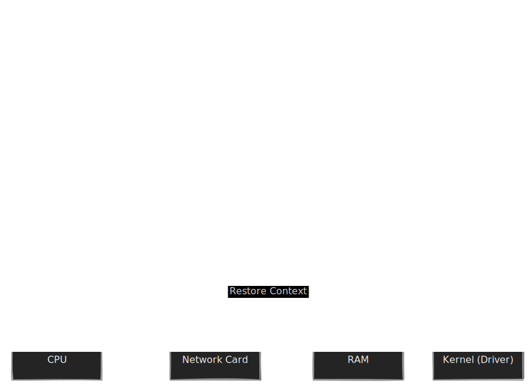

Welcome to the border control of your computer.

Up until now, we've been looking at the hardware itself—the CPU, the RAM, the spinning rust of the hard drive. But as a data engineer, you rarely touch the hardware directly. In fact, if you tried to write a Python script that directly manipulates the voltage on the CPU pins, the Operating System (OS) would tackle you before you could finish typing `import`.

To understand why our data pipelines behave the way they do, we have to understand the invisible wall between the code we write and the machine that runs it. This is the story of **User Space** and **Kernel Space**.

## 5.1 System Calls
Imagine your computer is a high-security bank vault. Inside the vault (the hardware), there are piles of gold (memory), safety deposit boxes (disk), and pneumatic tubes to the outside world (network).

You, the engineer, are a customer standing in the lobby. This lobby is **User Space**. It's comfortable, you can walk around freely, and you can calculate your net worth on a piece of paper (CPU operations) as much as you want.

But you are **not allowed** inside the vault.

If you want to store a document or get some gold, you have to approach the teller window. The teller is the **Kernel**. You pass a slip of paper through the glass request window. The teller checks your ID, disappears into the back, does the dangerous work, and comes back with a result.

That slip of paper? That is a **System Call**.

### The Protection Rings
In the architecture of a CPU (specifically x86), this operation is enforced physically. The CPU operates in different "Protection Rings."

- **Ring 0 (Kernel Mode)**: Total omnipotence. Code running here can execute any instruction and access any memory address. If code crashes here, the whole machine goes down (hello, Blue Screen of Death).
- **Ring 3 (User Mode)**: Restricted access. You cannot touch hardware directly. You cannot read memory belonging to other processes. If code crashes here, the OS just kills your process, cleans up the mess, and life goes on.

Your Python, Java, or Go code lives entirely in Ring 3.

### Crossing the Boundary
So, what happens physically when you run a simple command like `print("Hello, world?")`? You aren't just printing text; you are asking the video driver to illuminate specific pixels on a screen. That requires hardware access.

Here is the mechanical sequence of events, often called a **Trap** or a **Software Interrupt**:

1. **The Setup**: Your program puts the data it wants to write (and the ID of the system call, e.g., `write`) into specific CPU registers.
2. **The Trap**: Your program executes a special instruction (like `SYSCALL` on x86-64).
3. **The Mode Switch**: The CPU immediately switches from Ring 3 to Ring 0. Control is ripped away from your code and handed to the kernel.
4. **The Execution**: The kernel looks at the registers, sees you want to `write`, verifies you have permission to write to that location, and dispatches the work to the driver.
5. **The Return**: The kernel puts the result (success/failure) into a register, switches back to Ring 3, and hands control back to your code.


!!! note "We rarely write Syscalls directly"

    In reality, you almost never write assembly to trigger a `SYSCALL`. You use high-level wrappers provided by the Standard Library (like `libc` in C/C++ or the runtime in Python/Java). When you call `open()` in Python, Python calls `fopen` in C, which eventually sets up the registers and triggers the kernel trap.

### The Tax of the Teller Window
This brings us to the most critical concept for performance tuning: **Mode Switches are expensive**.

Think back to the bank teller analogy. If you have 1,000 one-dollar bills to deposit, you have two choices:

1. **Sequential**: Walk to the window, hand over $1, and wait for the receipt. Walk to the back of the line. Repeat 999 times.
2. **Batches**: Put $1,000 in a bag. Walk to the window once. Hand over the bag. Get one receipt.

Every time the CPU switches from User Mode to Kernel Mode, it has to save the state of your registers, perhaps flush some fast CPU caches, and run security checks. In the nanosecond world of a CPU, this is a massive bureaucratic delay.

!!! tip "Data Engineering Context: The 'Batch Insert' Principle"

    This physics explains why **Batching** is the golden rule of data engineering.

    Junior engineers often write code like this:

    ```python
    # The "Chatty" Approach
    for record in one_million_records:
        # Triggers a network syscall + disk syscall PER ROW
        db.execute("INSERT INTO users VALUES (...)", record)
    ```

    From a logic perspective, this works. From a systems perspective, this is a disaster. You are forcing the CPU to cross the User/Kernel boundary (and the network stack) 1,000,000 times. The CPU spends more time switching modes than actually moving data.

    This is why we use:

    - **Postgres:** `COPY` command or multi-value `INSERT`.
    - **Kafka:** Producer `batch.size` settings.
    - **Spark:** `write.parquet` (writes huge blocks at once).

    We want to fill the bag (User Space buffer) as much as possible before we bother the Teller (Kernel) to do the I/O.

### Visualizing the Overhead
Let's look at the flow of a chatty application versus a buffered one.


In the "Chatty" version, the orange boxes represent the expensive mode switch. In the "Buffered" version, we stay in the green User Space (which is practically free) for as long as possible.

## 5.2 Context Switching
If System Calls are about crossing the border, **Context Switching** is about changing who is sitting in the driver's seat.

We often say that computers can "multitask." We see Spotify playing music while we write SQL in a terminal while a browser downloads a CSV in the background. It feels simultaneous.

But unless you have a 64-core monster machine (and even then, you likely have hundreds of processes running), this simultaneity is a lie. A beautiful, carefully orchestrated lie.

Your CPU is actually a serial worker. It does one thing, then stops, then does another thing, then stops. It just does this switching so incredibly fast—thousands of times per second—that to our eyes, it looks like everything is happening at once.

However, just like in real life, multitasking comes with a heavy cognitive tax.

### The Stop-and-Swap
Imagine you are deep in the zone, debugging a complex regex. You have the string structure loaded in your short-term memory, your variable names are fresh in your mind, and you are about to solve the bug.

Suddenly, a manager walks in and screams, "Stop! I need you to fill out this expense report immediately!"

You can't just instantly switch. You have to.

1. **Save your state**: Write down exactly where you were in the code so you don't lose your place.
2. **Clear your desk**: Move the pipeline papers aside.
3. **Load the new state**: Pull out the expense report folder and figure out where you left off last time.

In the OS, this is a **Context Switch**.

When the operating system decides a process (let's say, your Python script) has had enough time on the CPU (usually a "time slice" of a few milliseconds), or if your process gets blocked waiting for I/O, the OS performs a "Stop-and-Swap":

1. **Freeze**: The hardware interrupt fires (often a timer).
2. **Save**: The OS takes a snapshot of the CPU's current state—the **Registers**, the **Instruction Pointer** (where exactly in the code it was executing), and the **Stack Pointer**. It saves this into a data structure called the **Process Control Block (PCB)**.
3. **Flush**: This is the invisible killer. The ultra-fast L1 and L2 caches (from module 2) are currently full of data relevant to your Python script. When the new process starts, that data is useless. The cache is now "cold."
4. **Load**: The OS looks up the PCB for the *next process* (say, the Spotify daemon), loads its register values back onto the CPU, and hits "Play."

### The "Tax" of Concurrency
Why do we care? Because context switching is **pure overhead**.

During the time the CPU is saving registers and switching tasks, *no actual work* is getting done. If a context switch takes 5 microseconds, and you switch 1,000 times a second, you are losing 0.5% of your CPU time. That's negligible.

But what if you switch 100,000 times a second?

!!! tip "Data Engineering Context: Thread Pools"

    This physics dictates the architecture of almost every modern data tool.

    - **Web Servers (Gunicorn/uWSGI):** We don't spawn a new process for every single incoming HTTP request. We use a **Worker Pool** (fixed number of processes, usually `2 x CPU Cores + 1`). We want to keep those workers busy, not shuffle them around.
    - **Databases (Postgres):** Postgres uses a process-per-connection model. This is why opening 10,000 connections to Postgres kills it—not because of the data volume, but because the OS is thrashing while trying to schedule 10,000 processes. This is why we put **PgBouncer** in front of it—to multiplex many users into a small, stable set of server connections.

## 5.3 Interrupts and Signals
We have talked about how the CPU is a focused worker, chugging through instructions one by one. But a computer that only looked inward would be useless. It needs to react to the outside world. It needs to know when you type a key, when a network packet arrives, or when the hard drive finishes spinning up.

How does a piece of metal (the CPU) know that an event happened on a different piece of metal (the network card)?

There are two ways to do this: **Polling** and **Interrupts**.

### Polling vs. Interrupts
Imagine you are waiting for a pizza delivery.

1. **Polling**: You stop what you are doing every 10 seconds, walk to the door, open it, check for the pizza guy, and close it. You get very little work done because you are constantly checking the door.
2. **Interrupts**: You install a doorbell. You focus entirely on your work. When the pizza arrives, the driver rings the bell. You stop, get the pizza, and then return to work.

Computers used to use polling (and some ultra-low-latency systems still do), but modern systems rely on **interrupts**.

### Hardware Interrupts (The Doorbell)
An interrupt is a physical electrical signal. When the Network Interface Card (NIC) receives a packet of data, it raises the voltage on a specific pin connecting to the CPU (the **IRQ** line).

This voltage spike forces the CPU to physically stop executing the current instruction *immediately*.

1. **The Jolt**: The CPU pauses the current process (saves the registers).
2. **The Lookup**: The CPU looks at a specific place in memory called the **Interrupt Vector Table**. This is a list of phone numbers for "Handlers."
3. **The Handler**: The CPU jumps to the code responsible for that specific interrupt (e.g., the network driver).
4. **The Action**: The network driver copies the data from the NIC buffer into main RAM.
5. **The Resume**: The CPU restores the saved registers and goes back to whatever it was doing before the doorbell rang.

This is why your mouse moves smoothly even if your code is calculating PI to the billionth digit. The mouse hardware is spamming the CPU with interrupts ("I moved! I moved!"), and the CPU is pausing your math thousands of times a second to update the *cursor* position.



### Signals (The Tap on the Shoulder)
While **Interrupts** are how hardware talks to the kernel, **Signals** are how the kernel talks to your process (User Space).

Think of signals as software-level interrupts. The OS injects a notification into your process to tell it something important has happened. You have likely seen these names in your logs:

- **SIGINT (Signal Interrupt)**: Triggered when you press `CTRL+C`. It politely asks the process to stop.
- **SIGSEGV (Segmentation Violation)**: The "Segfault." You tried to access memory that doesn't belong to you. The kernel steps in and kills your process instantly to protect the system.
- **SIGPIPE**: You wrote data to a pipe (like `|` in bash), but the process on the other end closed the connection.
- **SIGKILL**: The "Nuclear Option" (`kill -9`). This signal cannot be caught or ignored. The OS murders the process immediately. No cleanup allowed.

!!! tip "Data Engineering Context: Graceful Shutdown"

    Handling signals correctly is the difference between a professional data pipeline and a flaky script.

    In **Kubernetes (K8s)**, when a pod is scaled down, K8s sends a `SIGTERM` to your container.

    - **Bad Engineer:** Ignores the signal. The script keeps running. After 30 seconds (default), K8s loses patience and sends `SIGKILL`. The script dies in the middle of writing a file, leaving you with a corrupt Parquet file or a half-written database transaction.
    - **Good Engineer:** Catches the `SIGTERM` in Python (for example):

    ```python
    import signal
    import sys

    def graceful_exit(signum, frame):
        print("Received SIGTERM! Finishing current batch...")
        finish_batch()
        sys.exit(0)

    signal.signal(signal.SIGTERM, graceful_exit)
    ```

    This ensures data integrity. The process acknowledges the shutdown request, finishes its current "unit of work," and exits cleanly.

## Quiz

<quiz>
In the context of CPU Protection Rings on x86 architecture, where does standard application code (like a Python script) execute?
- [x] Ring 3 (User Mode).
- [ ] Ring 0 (Kernel Mode).
- [ ] The Hypervisor Layer.
- [ ] Ring 1 (Device Drivers).

</quiz>

<quiz>
Why is performing thousands of tiny database inserts sequentially (one by one) generally slower than batching them into a single request?
- [x] It forces the CPU to switch between User Mode and Kernel Mode thousands of times.
- [ ] The network cable gets overheated by rapid signals.
- [ ] Python is inherently incapable of fast loops.
- [ ] The database hard drive cannot spin fast enough.

</quiz>

<quiz>
When a 'Context Switch' occurs, what is the 'invisible killer' regarding performance that happens immediately after the switch?
- [ ] The network interface card disconnects.
- [ ] The hard drive formats itself.
- [ ] The CPU registers are permanently erased.
- [x] The CPU caches (L1/L2) are now 'cold,' containing data for the wrong process.

</quiz>

<quiz>
Which mechanism allows a hardware device (like a network card) to get the CPU's attention immediately without the CPU constantly checking for updates?
- [x] Hardware Interrupts (IRQ).
- [ ] Direct Memory Access (DMA).
- [ ] Context Switching.
- [ ] Polling.

</quiz>

<quiz>
What is the specific instruction used to transition from User Space to Kernel Space?
- [ ] `JUMP`.
- [x] `SYSCALL` (or `TRAP`).
- [ ] `HALT`.
- [ ] `PRINT`.

</quiz>

<quiz>
Which signal is known as the 'Nuclear Option' because it cannot be caught, ignored, or handled by the process?
- [ ] `SIGINT`.
- [x] `SIGKILL`.
- [ ] `SIGTERM`. 
- [ ] `SIGSEGV`.

</quiz>

<quiz>
In data engineering, why is it considered a 'best practice' to catch the `SIGTERM` signal in your code?
- [ ] To prevent the operating system from ever closing your program.
- [ ] To increase the priority of the process.
- [x] To perform a 'Graceful Shutdown' and finish the current unit of work.
- [ ] To speed up the CPU clock speed.

</quiz>

<quiz>
What happens if you spawn significantly more threads than your CPU has cores (e.g., 5,000 threads on a 4-core machine)?
- [ ] The CPU automatically downloads more RAM.
- [ ] The program runs 5,000 times faster.
- [ ] The OS converts the threads into separate physical CPUs.
- [x] Thrashing (performance degradation).

</quiz>

<quiz>
What data structure does the OS use to store the state of a paused process (registers, instruction pointer, etc.)?
- [ ] The File System Table (`fstab`).
- [x] The Process Control Block (PCB).
- [ ] The L3 Cache.
- [ ] The Interrupt Vector table.

</quiz>

<quiz>
A 'System Call' is required for a program to perform purely mathematical calculations (like `x = 5 + 5`).
- [ ] True
- [x] False

</quiz>

<!-- mkdocs-quiz results -->