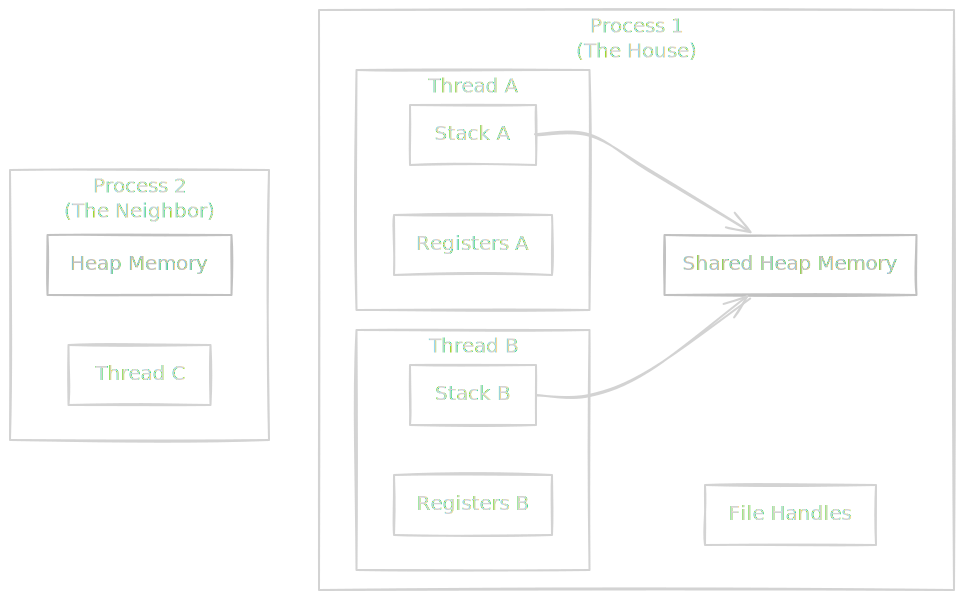
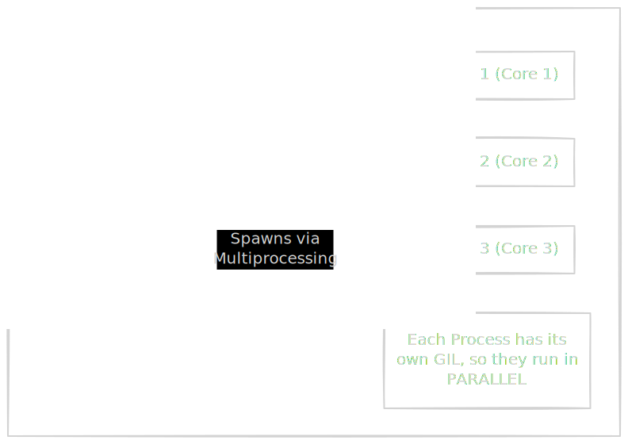

If the kernel is the "Bank Teller" managing the vault, **Process Management** is the HR department.

Your computer has finite resources (CPU, RAM) but infinite demand. You want to run Chrome, Slack, Spotify, Docker, and your Python script all at the same time. The operating system's job is to create the illusion that these are all running simultaneously while preventing them from fighting over the last stapler.

This brings us to the fundamental unit of work: the **Process** and its lighter sibling, the **Thread**.

## 6.1 Process vs. Thread
In technical interviews and architecture meetings, people often use these terms interchangeably. They are wrong. The difference between a Process and a Thread is the difference between building a new house and hiring a new roommate.

### The Process: The House
A **Process** is a fully isolated instance of a running program.

- **Isolation**: It has its own virtual memory address space.
- **Resources**: It owns file handles (open files), network sockets, and environment variables.
- **Safety**: If Process A crashes (segfaults), Process B is completely unaffected. They are neighbors, but they live in different houses.
- **Cost**: Creating a process is "heavy." The OS has to allocate a new memory map, set up the PCB (Process Control Block), and initialize permissions.

### The Thread: The Roommate
A **Thread** (Lightweight Process) lives *inside* a Process.

- **Shared Memory**: All threads within a process share the exact same Heap memory. If Thread A updates a global variable `counter`, Thread B sees the change immediately.
- **Low Overhead**: Creating a thread is cheap. You don't need new memory tables; you just need a small stack for local variables.
- **Danger**: If Thread A crashes (e.g., divides by zero or corrupts memory), **the entire Process dies**, killing Threads B, C, and D instantly.



### The Python Problem: The GIL
Now, here is the plot twist that haunts every Python Data Engineer.

You buy a 32-core server. You write a Python script using `threading` to process 10 million rows of data. You look at `htop` (the system monitor), expecting to see 32 green bars lighting up at 100%.

Instead, you see one core at 100%, and the other 31 cores sitting at 0%.

Why?

!!! tip "Data Engineering Context: The Global Interpreter (GIL)"

    Python (specifically CPython, the standard version) was not designed for multi-core parallelism. It has a mutex called the **GIL**.

    **The Rule**: Only **one thread** can hold the Python Interpreter at a time.
    
    Even if you have 10 threads, they cannot run Python bytecode simultaneously. Thread A runs for a few milliseconds, releases the lock, and waits. Thread B grabs the lock, runs, and waits.

    This turns your multi-threaded program into a **sequential** program with extra overhead!

**So, how do we fix it?**

We have to choose the right tool for the job.

**Scenario A: I/O Bound (Waiting for Network/Disk)**

- **Example**: Scraping 1,000 websites or querying an API.
- **Bottleneck**: Waiting for the server to reply.
- **Solution**: Use **Threads** (`ThreadPoolExecutor`).
    - While Thread A is waiting for a response (sleeping), it releases the GIL. Thread B can then run. This works great!
- **

**Scenario B: CPU Bound (Crunching Numbers)**

- **Example**: Parsing JSON, Regex matching, Image processing, and Pandas transformations.
- **Bottleneck**: The CPU itself.
- **Solution**: **Use Processes** (`ProcessPoolExecutor`).
    - Since threads are locked by the GIL, we simply spawn **multiple Python processes**.
    - Each Process gets its own GIL and its own CPU core.
    - *Downside*: You have to copy the data between processes (Pickling), which is slower than shared memory, but at least you are using all 32 cores.



## 6.2 The Scheduler
We have our workers (Processes and Threads). Now we need a boss to tell them when to work and when to sit on the bench.

This boss is the **scheduler**.

The scheduler is a piece of code inside the kernel that decides, hundreds of times per second, which process gets to use the CPU. Its goal is impossible: make every program feel like it has 100% of the CPU while actually giving them each only 1% of the time.

### The State Machine of Life
To understand the scheduler, you have to understand that a process is not always "running." In fact, most of the time, your processes are doing absolutely nothing.

A process exists in one of three main states:

1. **Running**: Actually executing instructions on the CPU right now. (Only 1 process per core can be here).
2. **Ready**: Sitting on the bench, warmed up, and screaming "Put me in, Coach!" It *could* run, but another process is currently using the CPU.
3. **Blocked (Waiting)**: Asleep. It cannot run even if the CPU is free. It is waiting for something slow—like a disk read, a network packet, or user input.

### Preemptive Multitasking
Early operating systems (like Windows 3.1) used **Cooperative Multitasking**. This meant a program would run until it *voluntarily* gave up the CPU. If a program had a bug and entered an infinite loop, the whole computer froze. You had to pull the plug.

Modern OSs (Linux, macOS, Windows 10+) use **Preemptive Multitasking**.

The scheduler is a dictator. It does not ask for permissions. It uses the hardware timer interrupt (from module 5.3) to forcibly rip the CPU away from a process after its "Time Slice" (usually 10-100 ms) is up.

- **Process A**: "I'm calculating Pi! 3.1415…"
- **Scheduler**: "Time's up. Sit down."
- **Process B**: "I'm checking email…"
- **Scheduler**: "Go."

### Priority & The "Nice" Value
Not all processes are created equal.

If your **Video Game** lags for 100 ms, you die and you rage-quit. If your **Dropbox Sync** lags for 100 ms, you don't even notice.

The OS solves this with **Priority Queue**. Processes that need low latency (interactive apps) get higher priority. Background tasks get lower priority.

In Linux/Unix, we control this with a value called **Nice**.

- It ranges from **-20** (most selfish/highest priority) to **+19** (nicest/lowest priority).
- The default is 0.
- "High niceness" means you are very polite, "Oh, no, you go first, I insist." (You get less CPU).
- "Low niceness" means you are a bully. "Out of my way!" (You get more CPU).

!!! tip "Data Engineering Context: Why your ETL job got killed"

    In shared environments (like a shared Jenkins server or a legacy Hadoop cluster), resource contention is war.

    Imagine you start a massive Python ETL script that uses 100% CPU to parse JSON logs. You run it with default priority (0).

    Suddenly, the **Production Database** on the same server gets a spike in traffic. The database handles requests, but your Python script is fighting it for CPU cycles. The database starts lagging. The CTO starts yelling.

    The System Administrator (SysAdmin) logs in, sees your script eating 100% CPU, and kills it.

    **The Fix:** Be nice. Literally.

    ```bash
    # Run your heavy script with low priority (+10)
    nice -n 10 python my_heavy_etl.py
    ```

    This tells the Scheduler: "Only run this script if *nobody else* needs the CPU." Your script runs at full speed when the server is idle but instantly throttles down when the database needs resources.

### The I/O Bonus
Here is a secret about the scheduler. **It loves processes that sleep**.

If a process is **I/O Bound** (it runs for a microsecond, then requests a file and goes to Blocked state), the scheduler gives it a "priority boost."

Why? Because it's "cheap" to schedule. It only needs the CPU for a tiny moment to keep the data moving.

If a process is **CPU Bound** (it calculates math for its entire time slice without stopping), the scheduler punishes it. It lowers its priority, effectively saying, "You are a resource hog. You go to the back of the line."

!!! note "The Database vs. The Batch Job"

    This is why a Database (mostly I/O bound, waiting for disk) usually stays responsive even when a heavy analytics job (CPU Bound) is running. The scheduler naturally favors the database's short, bursty requests over the analytics job's long, monotonous crunching.

## 6.3 Concurrency and Locking
We have arrived at the most notoriously difficult topic in computer science.

If **Process Management** is the HR department, **Concurrency** is the office kitchen.

Imagine you have two chefs (Threads) sharing one cutting board (memory).

- Chef A starts chopping onions.
- Chef A turns around to grab a knife.
- While Chef A is turned around, Chef B wipes the board down with a soapy rag.
- Chef A turns back and puts the onions on the soapy board.
- **Result**: Soapy onions.

This is a **Race Condition**. It happens when the correctness of your program depends on the precise (and uncontrollable) timing of the scheduler.

### The "Lost Update" Bug
Let's look at the classic bank account example. You have $100. Two threads try to deposit $10 at the *exact same time*.

**The Code**:

```python
balance = read_balance()  # Step 1
balance = balance + 10    # Step 2
write_balance(balance)    # Step 3
```

**The Disaster (Race Condition)**:

1. **Thread A** reads balance ($100).
2. **Thread B** reads balance ($100). *(Thread A hasn't written the new balance yet.)*
3. **Thread A** calculates $100 + $10 = $110.
4. **Thread B** calculates $100 + $10 = $110.
5. **Thread A** writes $110.
6. **Thread B** writes $110.

**Result**: You have $110. You *should* have $120. $10 has vanished into the ether.


### The Solution: The Mutex (Lock)
To fix this, we need a way to say, "I am using this variable. Nobody touch it until I am done."

We use a **Mutex** (Mutual Exclusion). Think of it like the key to a gas station bathroom. Only one person can hold the key at a time. If you want the key, and it's gone, you have to stand outside and wait.

**The Fixed Code**:

```python
mutex.lock()                # Get the key
try:
    balance = read_balance()
    balance = balance + 10
    write_balance(balance)
finally:
    mutex.unlock()          # Return the key
```

Now, if Thread B tries to run, it hits `mutex.lock()`. The OS sees the key is taken, so it puts Thread B to sleep (Blocked State) until Thread A finishes.

### The New Problem: Deadlocks
Locks solve race conditions, but they introduce a terrifying new bug: **The Deadlock**.

Imagine two resources: a printer and a scanner.

- **Thread A** grabs the **printer**.
- **Thread B** grabs the **scanner**.
- **Thread A** tries to grab the **scanner** (to scan the document it just printed). Wait, Thread B has it. Thread A waits.
- **Thread B** tries to grab the **printer**. Wait, Thread A has it. Thread B waits.

Both threads are now waiting for each other. They will wait forever. The program hangs.


!!! tip "Data Engineering Context: Database Row Locking"

    You will encounter this constantly in databases like Postgres or MySQL.

    When you run `UPDATE users SET age = 30 WHERE id = 5`, the database **locks that specific row**. No other transaction can modify user #5 until you commit.

    **The Deadlock Scenario:**

    - **Transaction 1:** Updates User A... then tries to update User B.
    - **Transaction 2:** Updates User B... then tries to update User A.

    If these happen at the same time, both transactions freeze. Thankfully, modern databases have a **Deadlock Detector**. The database wakes up, sees the cycle, picks a "victim" (one of the transactions), and kills it with an error message: `deadlock detected`.

    **How to avoid this?** Always access resources in the **same order**. If everyone updates User A and then User B, a deadlock is impossible.

## Quiz

<quiz>
What is the primary difference between a Process and a Thread regarding memory access?
- [x] Threads within the same process share the heap, while processes have isolated memory space.
- [ ] Both processes and threads share all memory with every other program on the computer.
- [ ] Threads cannot access any memory; they only use CPU registers.
- [ ] Processes share the same heap memory, while threads are isolated.

</quiz>

<quiz>
In the context of stability, what happens if a single thread within a multi-threaded application crashes (e.g., segfaults)?
- [ ] The operating system immediately restarts the thread.
- [ ] The thread is moved to the 'Blocked' state permanently.
- [ ] Only that specific thread stops, and the others continue.
- [x] The entire process (and all other threads inside it) crashes.

</quiz>

<quiz>
Why does adding more threads to a CPU-bound Python script often fail to speed it up?
- [ ] Python threads are actually run on the GPU, not the CPU.
- [x] The Global Interpreter Lock (GIL) prevents more than one thread from executing Python bytecode at a time.
- [ ] The scheduler ignores Python threads because they have low priority.
- [ ] Threads consume too much memory compared to processes.

</quiz>

<quiz>
Which architecture should you choose for a Python application that needs to perform heavy CPU calculations (like image processing) across multiple cores?
- [ ] AsyncIO.
- [ ] Multi-threading (ThreadPoolExecutor).
- [x] Multi-processing (ProcessPoolExecutor).
- [ ] Sequential execution.

</quiz>

<quiz>
When a process needs to read a file from the disk, what state does the scheduler place it in while it waits for the data?
- [ ] Running.
- [x] Blocked (Waiting).
- [ ] Ready.
- [ ] Zombie.

</quiz>

<quiz>
If you want to run a heavy background ETL job without slowing down the production database on the same server, what should you do?
- [ ] Increase the number of threads in the ETL job.
- [ ] Run it with a low 'Nice' value (e.g., -20).
- [ ] Disable the operating system scheduler.
- [x] Run it with a high 'Nice' value (e.g., +19).

</quiz>

<quiz>
A 'Race Condition' occurs when:
- [ ] A process refuses to give up the CPU after its time slice ends.
- [ ] Two threads wait for each other indefinitely.
- [ ] Two processes run faster than the CPU clock speed.
- [x] The correctness of the program depends on the unpredictable timing of threads accessing shared data.

</quiz>

<quiz>
What is the primary purpose of a Mutex (Lock)?
- [ ] To prevent the OS from Context Switching.
- [ ] To make the program run faster.
- [x] To ensure only one thread can access a shared resource at a time.
- [ ] To synchronize the system clock.

</quiz>

<quiz>
What is a 'Deadlock'?
- [ ] When the CPU overheats and shuts down.
- [x] A cycle where Thread A waits for a resource held by Thread B, and Thread B waits for a resource held by Thread A.
- [ ] When a variable is read before it is written.
- [ ] When a process crashes and leaves a 'zombie' entry in the process table.

</quiz>

<quiz>
Why does the OS scheduler generally prefer (give a priority boost to) I/O bound processes over CPU bound processes?
- [x] Because I/O bound processes (like databases) need to be responsive, and they only use the CPU for short bursts.
- [ ] Because CPU bound processes are more likely to crash.
- [ ] Because the scheduler cannot interrupt a CPU bound process.
- [ ] Because CPU bound processes consume less power.

</quiz>

<!-- mkdocs-quiz results -->