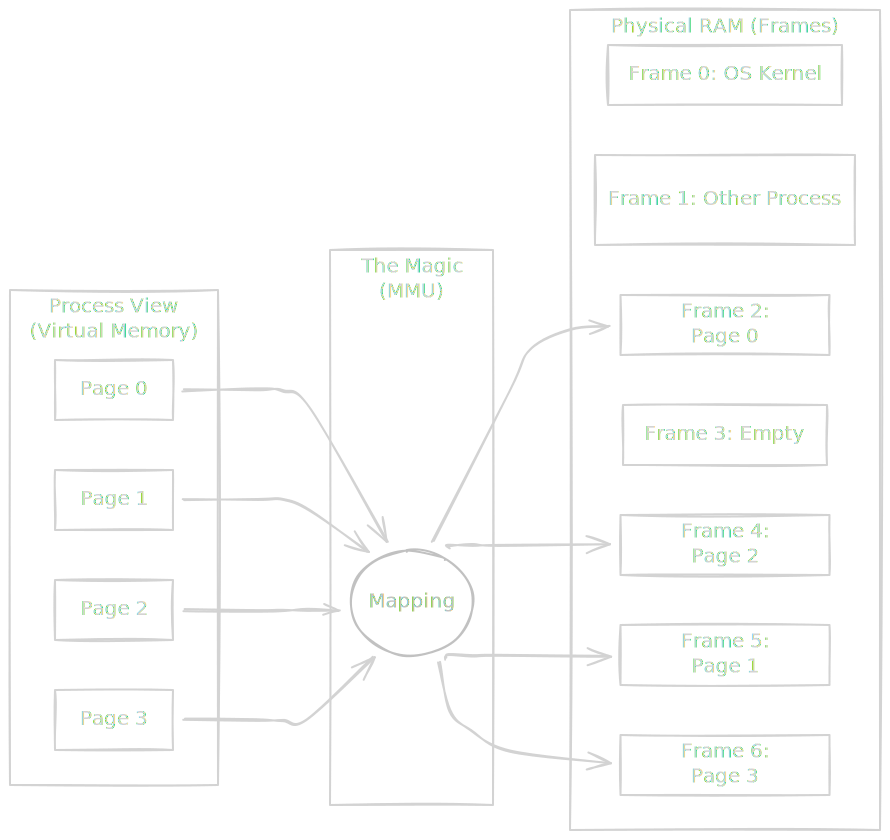
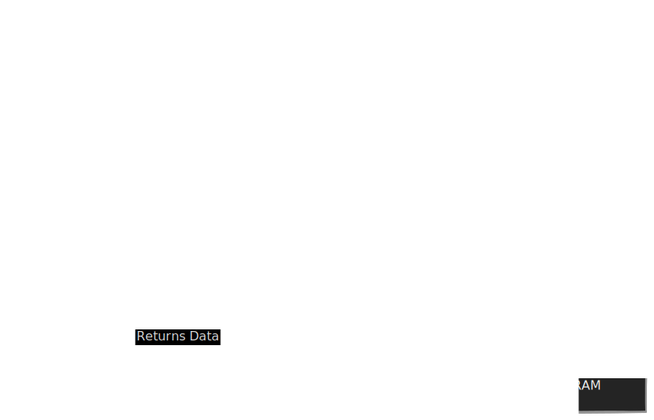
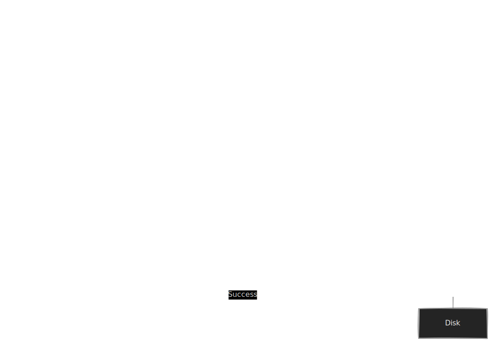

If you have ever written a Python script that loads a massive CSV or a Spark job that processes terabytes of data, you have relied on a comfortable lie.

The lie is this: your program believes it has access to a massive, contiguous block of memory, starting at address 0 and stretching out to infinity (or at least, to the limits of your 64-bit address space). It believes it is the only process running on the machine, the king of the castle.

In reality, your program is living in a fragmented, chaotic reality, sharing physical RAM with hundreds of other processes. If your program actually tried to access physical address 0, the kernel would kill it instantly for trespassing.

Welcome to **Virtual Memory**. This is the layer of magic that allows us to run a 10 GB database on a laptop with 8 GB of RAM, and it acts as the peacekeeper that prevents a buggy extraction script from crashing the entire operating system.

## 7.1 Paging and Frames
To understand virtual memory, we have to look at how the operating system manages the "warehouse" of RAM.

In the early days of computing, if you wanted to run a program, the OS would carve out a literal chunk of physical RAM—say, from index 1024 to 2048—and hand it to you. This creates two massive problems:

1. **Fragmentation**: If you loaded and closed enough programs of different sizes, your RAM would look like a block of Swiss cheese. You might have 1 GB of free space total, but if it's scattered in 1 KB chunks, you can't load a 50 MB program.
2. **Insecurity**: If program A can calculate the physical address of program B, it can read (or overwrite) its data. This is how malware spreads.

To solve this, we stopped letting programs see physical addresses. Instead, we introduced an abstraction.

### The Great Decoupling
The OS chops memory into fixed-size chunks.

- **Pages**: These are chunks of **Virtual Memory** (what your program sees).
- **Frames**: These are chunks of **Physical RAM** (what the hardware actually holds).

The standard size for both is 4 KB (4,096 bytes).

Think of physical RAM like a massive parking garage. The parking spots are the **Frames**. They are numbered 0 to $N$.

Your program doesn't get to know about the garage. Instead, the OS gives your program a booklet of valet tickets. These are the **Pages**. Your program says, "Put this data in Page 0." The OS (the valet) takes the data and parks it in any available spot (Frame) in the garage—maybe Frame 542, maybe Frame 99.

Your program sees a neat, sequential list of pages. The physical reality is a scattered mess.



### The Page Table
So, who keeps track of which valet ticket corresponds to which parking spot? That is the **Page Table**.

Every single process running on your machine has its own Page Table. It is simply a dictionary (lookup table) managed by the OS.

$$
\text{Virtual Page Number (VPN) } \to \text{ Physical Frame Number (PFN) }
$$

When your code executes an instruction like `LOAD 0x1234` (load data from memory address 4660), the hardware cannot go to physical slot 4660. It has to translate.

1. **Split the Address**: The computer splits the address into two parts: the **Page Number** and the **Offset**.
2. **Lookup**: It looks up the Page Number in the Page Table to find the Frame Number.
3. **Combine**: It takes the physical Frame Number and adds the original offset to find the exact byte in RAM.

!!! note "The 4 KB Shortcut"

    Why are pages usually 4 KB? It's a "Goldilocks" number. If pages are too small (e.g., 64 bytes), the Page Table becomes huge because you need millions of entries to map 16 GB of RAM. If pages are too big (e.g., 64 MB), you waste space if a small program only needs 10 KB but has to occupy a full 64 MB frame.

### The Hardware Helper: The MMU
If the OS had to stop and run a software lookup function for *every single memory access*, your computer would be unusably slow. Memory access happens billions of times per second.

This translation is handled by a specialized piece of hardware on the CPU called the **Memory Management Unit (MMU)**.

The MMU is the gatekeeper. It sits between the CPU and the RAM.



If the MMU looks at the Page Table and sees that a Page is *not* currently mapped to a physical frame (maybe it hasn't been allocated yet, or it was swapped out), it raises a hardware exception called a **Page Fault**. This pauses the CPU and wakes up the OS kernel to fix the problem.

!!! tip "Data Engineering Context: Isolation and Multi-Tenancy"

    This mechanism is the foundation of modern data infrastructure.

    When you run a **Kubernetes** cluster or a **Spark** worker node, you are often running code from different teams or different jobs on the same physical machine.

    Because of Paging, Process A literally *cannot* generate a physical address that points to Process B's memory. The bits don't exist in its Page Table. This hardware-enforced isolation is what allows us to "bin pack" multiple unrelated Docker containers onto a single EC2 instance without them corrupting each other's data variables.

## 7.2 Swapping (Thrashing)
We previously established that Virtual Memory is a comfortable lie. The OS tells your program, "Sure, here is 16 GB of RAM," even if the machine only has 8 GB.

So, what happens when your programs actually use all 8 GB of physical frames, and then ask for more?

The OS doesn't panic. It looks at the crowded parking garage (RAM) and identifies a car that hasn't moved in a while (a "cold" page). It calls a tow truck, drags that car out of the garage, and dumps it into a muddy lot down the street.

That muddy lot is your Hard Drive (or SSD). This process is called **Swapping** (or Paging Out).

### The Page Fault
When a program tries to access a page that the OS has moved to the disk, the MMU checks the Page Table and sees a flag saying, "Not in RAM."

This triggers a **Page Fault**. Despite the scary name, this is a routine event. It's the hardware's way of saying, "I can't do this; OS, you hand it."

Here is the agonizingly slow recovery process that follows:

1. **Stop Everything**: The CPU pauses the execution of your program.
2. **Context Switch**: The OS kernel takes over.
3. **IO Request**: The OS looks up where the data was saved on the disk and issues a read command.
4. **Wait**: The CPU goes off to do work for other processes while the disk spins (or the SSD seeks).
5. **Eviction**: Once the data arrives, the OS needs a free Frame in RAM to put it in. If RAM is full, it must choose *another* page to kick out to disk to make room.
6. **Resume**: The OS updates the Page Table and tells the program, "Okay, try again."



### The Performance  Cliff: Thrashing
This mechanism works beautifully if you only touch the disk occasionally. But recall module 2: RAM is nanoseconds; disk is milliseconds. The disk is 100,000x slower than RAM.

If your active working set of data (the pages you are constantly reading/writing) exceeds physical RAM, you enter a state called **Thrashing**.

In this state, the OS spends more time moving data between RAM and disk than it spends actually executing your code.

- Process A runs, and needs Page 1, Page Fault.
- OS kicks out Page 2 to load Page 1.
- Process A resumes immediately needs Page 2. Page Fault.
- OS kicks out Page 1 to load Page 2.

Your computer becomes unresponsive. The mouse cursor stutters. The hard drive light turns solid on. You have fallen off the performance cliff.

!!! tip "Data Engineering Context: The Cliff"

    This is why system monitoring is tricky.

    If you are monitoring a database server, you might see Memory Usage at **90%** and think, "We are close to the limit, but fine."

    But memory performance is binary.

    - At **98% usage**, if the working set fits in RAM, the system runs at 100% speed.
    - At **101% usage**, you hit swap, and performance drops by **99%**.

    Unlike CPU usage, which degrades gracefully (things just get slower), memory usage fails catastrophically once you cross the physical limit. This is why we set alerts at 75-80%—to give us time to react before the cliff.

## 7.3 Memory Leaks
If Virtual Memory is the garage, **Memory Leaks** are what happens when you park cars but never drive them home, eventually filling the entire structure with abandoned vehicles. 

To understand **leaks**, we need to distinguish between the two areas where your program stores data: the **stack** and the **heap**.

**The Stack vs. The heap**

- **The Stack**: This is the tidy, organized workspace. It stores local variables inside functions. When a function finishes, all its variables are popped off the stack and vanish instantly. It is self-cleaning.
- **The Heap**: This is the chaotic open floor plan. It stores large, persistent objects (like a global list, a database connection, or a Pandas DataFrame). Variables here *do not disappear automatically* when a function ends; they stay until they are explicitly destroyed.

### The Leak
A memory leak occurs when  you allocate memory on the **heap** but lose all references to it without freeing it. The data sits there, occupying physical frames, but your program has no way to reach it or delete it.

In low-level languages like C, you have to manually type `free(pointer)`. If you forget, you leak. In high-level languages like Python or Java, we have a **Garbage Collector (GC)** that cleans up for us… usually.

### Garbage Collection (GC)
The GC is a background process (a janitor) that periodically scans the heap. It looks for "orphaned" data—objects that no variables point to anymore.

- **Reference Counting**: "Does anyone have a pointer to this object? No? Delete it."
- **Mark and Sweep**: "Start from the main function and trace every link. Anything I didn't visit is garbage."

However, even with GC, you can still leak memory in data engineering.

!!! warning "Common DE Bug: The Global Accumulator"

    A classic memory leak in Python data scripts happens when you accidentally keep a reference to data you thought you threw away.

    ```python
    # BAD PATTERN
    processed_records = []  # Global list

    def process_file(filename):
        df = pd.read_csv(filename)
        result = do_heavy_math(df)
        # We intend to just return the result,
        # but we accidentally store the HEAVY object in the global list
        processed_records.append(df) 
        return result
        
    while True:
        # This loop runs forever. 
        # 'processed_records' grows until the container crashes (OOM).
        new_file = wait_for_file()
        process_file(new_file)
    ```

    Because `processed_records` exists in the global scope, the Garbage Collector looks at those old DataFrames and says, "Well, the user put them in a list, so they must still want them!" It never cleans them up. Eventually: **OOM Kill (Out of Memory)**.

## Quiz

<quiz>
In the context of Virtual Memory, what is the fundamental difference between a 'Page' and a 'Frame'?
- [x] A Page is a chunk of Virtual Memory seen by the program, while a Frame is a physical slot in RAM.
- [ ] A Page is a physical slot in RAM, while a Frame is a virtual concept.
- [ ] Pages are used by the kernel, while Frames are used by User Space applications.
- [ ] Pages are always 4 KB, while Frames are always 2 MB.

</quiz>

<quiz>
Which specific hardware component is responsible for translating Virtual Addresses into Physical Addresses in real-time?
- [ ] The HDD controller.
- [x] The MMU (Memory Management Unit).
- [ ] The L3 Cache.
- [ ] The ALU (Arithmetic Logic Unit)

</quiz>

<quiz>
What event is triggered when a program tries to access a Virtual Page that is not currently mapped to a Physical Frame?
- [ ] Kernel Panic.
- [x] Page Fault.
- [ ] Segmentation Fault.
- [ ] Stack Overflow.

</quiz>

<quiz>
What is 'Thrashing'?
- [ ] When the CPU overheats due to excessive calculations.
- [ ] When a hard drive head physically crashes onto the platter.
- [ ] When a program creates too many threads and crashes the scheduler.
- [x] When the OS spends more time moving data between RAM and disk (swapping) than executing code.

</quiz>

<quiz>
Why is 'Swapping' (using disk as memory) considered a performance cliff?
- [x] Because disks are approximately 100,000x slower than RAM.
- [ ] Because the CPU cannot read from disk at all.
- [ ] Because disks cannot store binary data.
- [ ] Because swapping causes data corruption.

</quiz>

<quiz>
Which memory region is used for large, persistent objects like a Database connection or Pandas DataFrames?
- [ ] The Stack.
- [x] The Heap.
- [ ] The Registry.
- [ ] The Boot Sector.

</quiz>

<quiz>
How does Virtual Memory provide isolation between processes (e.g., preventing one Docker container from accessing another's data)?
- [ ] By encrypting the RAM chips physically.
- [ ] By using different hard drives for each process.
- [x] By ensuring Process A's Page Table has no mapping to Process B's physical frames.
- [ ] By pausing all other processes when one is active.

</quiz>

<quiz>
What is the primary function of the Garbage Collector (GC)?
- [x] To reclaim memory from objects that are no longer referenced by the program.
- [ ] To prevent Page Faults.
- [ ] To organize the Stack frames.
- [ ] To move data from RAM to the hard drive.

</quiz>

<quiz>
Why is the standard page size typically 4 KB?
- [x] It balances the size of the Page Table with the efficiency of memory allocation.
- [ ] It is the maximum amount of data a CPU can process in one cycle.
- [ ] It is the smallest unit physically writable to a modern SSD.
- [ ] It matches the exact size of a standard TCP packet.

</quiz>

<!-- mkdocs-quiz results -->