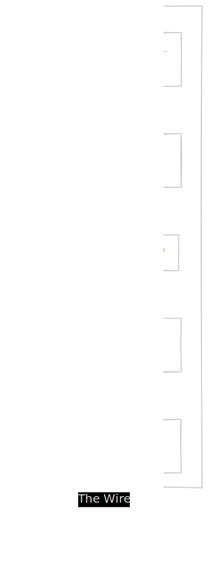
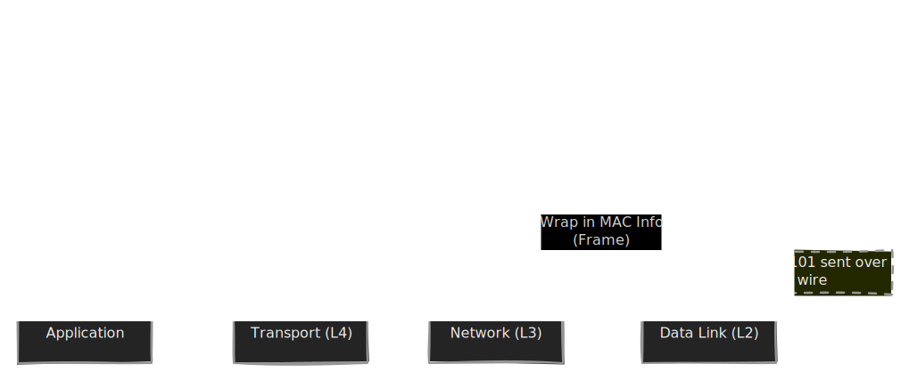
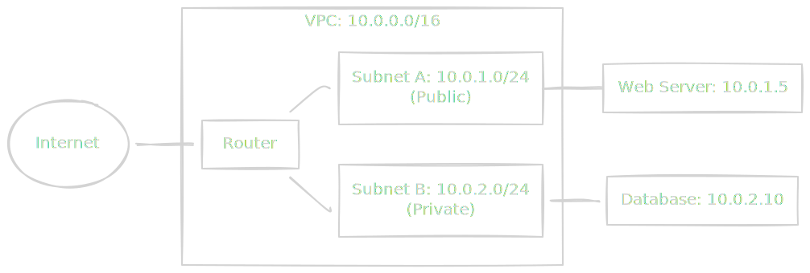
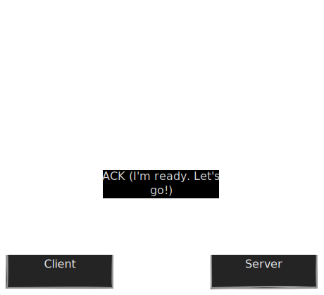

For a data engineer, the network is often the invisible ghost in the machine. You tune your Spark memory, you optimize your SQL queries, and you pick the perfect instance type, but your job still crawls. Why? Because moving data across a wire costs time, and that wire has rules. We tend to treat the network as an abstraction—a magic pipe that connects `System A` to `System B`. But when that pipe clogs, or when a firewall drops your packets silently into the void, the magic evaporates. To build robust data systems, we have to understand the plumbing.

## 8.1 The OSI Model & Packets
The internet is built on a philosophy of "Organized shouting." To prevent absolute chaos, we use a strict set of protocols arranged in layers. This structure is officially known as the **OSI (Open Systems Interconnection) Model**.

While academics love the 7-layer OSI model, engineers in the trenches usually think in terms of the **TCP/IP Model**, which is a bit more pragmatic. Regardless of the labels, the core idea is **Encapsulation**: wrapping data in successive layers of "envelopes" to get it where it needs to go.

### The Layer Cake of Abstraction
Think of the network stack as a set of Russian Nesting Dolls. Each layer provides a specific service to the layer above it and hides the messy details of the layer below it.

### The Journey: From Data to Bits
Let's say we want to send a single row of data from a database to a visualization tool. Here is how that "rock" prepares to travel:

1. **The Data (L7)**: This is your raw payload. `(User_ID: 123, Total_Spend: 50.00)`
2. **The Segment (L4)**: The Transport Layer wraps that data in a **TCP Header**. It adds "Source Port" and "Destination Port." This is how the receiving computer knows which specific application (the database vs. the web server) should get this data.
3. **The Packet (L3)**: The Network Layer wraps the segment in an **IP Header**. It adds the "Source IP" and "Destination IP." This is the "mailing address" that routers use to navigate the global internet.
4. **The Frame (L2)**: The Data Link Layer wraps the packet in an **Ethernet Header**. It adds **MAC Addresses**. This is crucial for "local" delivery—moving the data from your server to the router sitting right next to it in the rack.
5. **The Bits (L1)**: Finally, the hardware translates **all** those envelopes into physical pulses of electricity or light.

!!! note "The Pedantry of Names"

    In networking, words matter. If you call an L2 Frame a "Packet," a network engineer might give you a side-eye. 

    - **Layer 4** uses **Segments** (TCP) or **Datagrams** (UDP).
    - **Layer 3** uses **Packets**
    - **Layer 2** uses **Frames**.

### Why Encapsulation Matters to You
You might wonder why we bother with all these envelopes. Why not just send the raw data?

Isolation. If you decide to switch your office from copper wire (Ethernet) to fiber optics, you only change Layers 1 and 2. Your database (Layer 7) and your IP address (Layer 3) don't have to change a single thing. The "Russian Doll" approach allows the internet to evolve without breaking every application on earth.

!!! tip "Data Engineering Context: The Payload Tax"

    Every time you wrap your data in an envelope (Header), you add bytes. If you are sending tiny 10-byte messages (like individual sensor readings) one by one, you might spend more time sending "headers" than actual data. This is why **Batching** is the holy grail of data engineering. Sending one **1 MB** "envelope" is far more efficient than sending 1,000 "envelopes" of 1 KB.

!!! warning "The MTU Cliff"

    Most networks have a **Maximum Transmission Unit (MTU)** typically 1,500 bytes. If your "packet" (including all headers) exceeds this, the network must "fragment" it—breaking it into smaller pieces. This adds massive overhead and can cause "garbled data" bugs that are a nightmare to debug. In cloud environments like AWS, we often use **Jumbo Frames** (9,901 bytes) for internal data transfers to minimize these fragments.

## 8.2 IP & Routing (Layer 3)
In the last section, we talked about the "envelopes" (Encapsulation). Now, we need to talk about the addresses written on those envelopes and the global post office that reads them. This is **Layer 3: The Network Layer**.

If Layer 2 (Ethernet) is about moving data between two machines plugged into the same switch, Layer 3 is about moving data across the world—or at least across your cloud provider's data center. The star of the show here is the **Internet Protocol (IP)**.

### The Address: IPv4 vs. IPv6
Every device on a network needs a unique identifier. For decades, we've relied on **IPv4**. You've seen these: `192.168.1.1`. It's a 32-bit number, usually written as four "octets."

The problem? A 32-bit number only allows for about 4.3 billion addresses. In a world where your toaster, your watch, and every temporary Spark executor node needs an IP, we ran out of addresses years ago.

Enter **IPv6**; instead of 32 bits, it uses 128 bits. To give you a sense of scale, IPv6 provides enough addresses to assign an IP address to every single atom on the surface of the Earth… and still have enough left over for another hundred Earths. It looks like a hexadecimal fever dream: `2001:0db8:85a3:0000:0000:8a2e:0370:7334`.

!!! note "The Transition"

    Despite IPv6 being the "future" for twenty years, much of the internet plumbing of data engineering (VPCs, database connectors) still leans heavily on IPv4 because it's easier for humans to read and type.

### Subnets and CIDR: The Neighborhood Map
We don't just hand out IP addresses randomly. We organize them into **Subnets** (Sub-networks). Think of a subnet as a neighborhood. If you know the neighborhood, you don't need to know the exact house to get the mail to the right local post office.

We define these neighborhoods using **CIDR (Classless Inter-Domain Routing)** notation. It looks like this: `10.0.0.0/24`.

The `/24` is the "Subnet mask." It tells the computer, "The first 24 bits are the neighborhood name, and the remaining 8 bits are the specific house numbers."

- 10.0.0. (The Neighborhood)
- .0 to .255 (The Houses)

### NAT: The Corporate Receptionist
Since we are low on public IPv4 addresses, we use **NAT (Network Address Translation)**.

Imagine a large company with 1,000 employees but only one public phone number. When an outsider calls, they hit the **Receptionist (The NAT Gateway)**. When an employee calls out, the receptionist "maps" their internal extension to the public line.

In data engineering, your database is usually in a **Private Subnet**. It has an internal IP address (like `10.0.2.10`) that the outside world cannot see. If that database needs to download a security patch from the internet, it sends the request through a NAT Gateway. The internet thinks the request came from the Gateway's public IP.

!!! warning "The One-Way Street"

    NAT allows private machines to talk out to the internet, but it prevents the internet from talking *in* to them. This is a crucial security feature, not just a workaround for address shortages.

### Routing: The "Next Hop" Logic
A Router is just a specialized computer that looks at the destination IP of an incoming packet, consults a **Routing Table**, and decides which "door" (interface) to throw it out of. It doesn't know the whole path to the destination; it only knows the "Next Hop."

!!! tip "Data Engineering Context: Cloud VPCs and Security Groups"

    In the Cloud, "The Network" is software-defined. When you create a **VPC (Virtual Private Cloud)**, you are essentially defining your own Layer 3 world.

    - **Subnets:** You should isolate your "workers" (Spark/Flink) from your "storage" (RDS/Snowflake) using different subnets.
    - * **Security Groups:** These are **Stateful Firewalls** at the instance level. Even if a packet correctly routes to your database via IP, the Security Group acts like a bouncer at the door, checking if the "Source IP" and "Port" are on the VIP list.
    - **Peering:** If your Data Lake is in VPC A and your Analytics tool is in VPC B, you must "Peer" them. This updates the Routing Tables so the two VPCs can see each other’s internal IPs without going over the public internet.

### How a Router Thinks
When a packet arrives at a router, the logic is simple:

If you've ever seen a "Network Timeout" or "No Route to Host" error while trying to connect a Jupyter notebook to a Redshift cluster, you are likely looking at a Routing Table or a Security Group that is missing a "door" for your traffic.

## 8.3 TCP vs. UDP (Layer 4)
We've packaged our data (L7) and addressed the envelope (L3). Now we need a **Transport Protocol** to decide how that envelope is actually delivered.

In the world of networking, you generally have to choose between two philosophies: **Reliability** or **Speed**. This choice happens at Layer 4.

### TCP: The Obsessive Perfectionist
**TCP (Transmission Control Protocol)** is the "reliable" choice. It is the bedrock of almost everything we do in data engineering—database connections, API calls, and file transfers.

TCP treats the network like a  conversation between two polite, slightly paranoid librarians. It uses a **Three-Way Handshake** to ensure both parties are ready before a single byte of actual data is sent.

Once the "call" is established, TCP provides:

1. **Ordered Delivery**: If packet #2 arrives after packet #3, TCP holds #3 in a buffer until #2 shows up, then hands them to the application in the correct order.
2. **Error Correction**: If a packet is lost in the "tubes," the receiver notices the gap in sequence numbers and asks for a retransmission.
3. **Flow Control (Windowing)**: If the sender is a high-speed server and the receiver is a slow laptop, the laptop can tell the server, "Slow down! My buffer is full!"

!!! note "The Cost of Quality"

    All this reliability isn't free. The handshake adds **latency**, and the headers are larger. This is the "tax" we pay to ensure our database doesn't accidentally turn a `$1,000` deposit into a `$10` deposit because a few bits went missing.

### UDP: The Fire-and-Forget Method
**UDP  (User Datagram Protocol)** is the opposite. It is simple, lean, and reckless. There is no handshake. There is no "Did you get that?" There is no ordering. The sender just blasts packets at the destination IP.

If TCP is a certified letter that requires a signature, UDP is a guy throwing newspapers out of a moving car. If a newspaper lands in a puddle or the neighbor's yard, he doesn't care. He's already three blocks away.

**Why use it?** Because it's fast. Without the handshake and the constant "ACK" messages, the overhead is minimal. It's used for things where speed matters more than perfection:

- **Live Video/VOIP**: If you lose a frame of video, you don't want the stream to freeze while it waits for a re-send. You just want the next frame.
- **DNS**: Most DNS lookups use UDP because they are tiny and need to be near-instant.

### The "Physics" of Throughput: Windowing
One of the most important concepts for a data engineer is the **TCP Window**. Imagine a pipe between two machines.  You can't just shove 1 TB into the pipe all at once; you'd overflow the receiver's memory.

The "Window" is the amount of data the sender can transmit before it must stop and wait for an acknowledgement (ACK) from the receiver.

If you have a high-latency connection (e.g., sending data from a London data center to a New York data center), the "Time To ACK" increases. If your window is too small, your sender spends 90% of its time sitting idle, waiting for the "I got it!" message to travel across the Atlantic.

!!! tip "Data Engineering Context: Tuning the Pipe"

    This is why **BDP (Bandwidth-Delay Product)** matters. If you are moving massive amounts of data between cloud regions, you often need to tune the OS-level TCP buffer sizes. If the buffer (window) is too small, your 10 Gbps fiber link will behave like a 100 Mbps link because the protocol is too busy waiting for permission to send the next chunk.

## Quiz

<quiz>
Which term describes the process where each layer of the network stack wraps the data from the layer above it in its own header?
- [x] Encapsulation.
- [ ] Abstraction.
- [ ] Fragmentation.
- [ ] Serialization.

</quiz>

<quiz>
In the context of the OSI model, which layer is responsible for routing packets across different networks using IP addresses?
- [x] Layer 3 (Network).
- [ ] Layer 7 (Application).
- [ ] Layer 2 (Data Link).
- [ ] Layer 4 (Transport).

</quiz>

<quiz>
What is the correct unit of data for Layer 2 of the network stack?
- [ ] Packet.
- [ ] Segment.
- [x] Frame.
- [ ] Datagram.

</quiz>

<quiz>
If a data engineer decides to upgrade a data center from copper Ethernet cables to Fiber Optics, which layers of the OSI model are primarily being changed?
- [x] Layers 1 and 2.
- [ ] Layer 7.
- [ ] Layers 3 and 4.
- [ ] Layers 2 and 3.

</quiz>

<quiz>
In the CIDR block `10.0.0.0/16`, how many bits are used to define the 'network' or neighborhood part of the address?
- [ ] 32 bits.
- [ ] 24 bits.
- [ ] 8 bits.
- [x] 16 bits.

</quiz>

<quiz>
Why would a data engineer place a production database in a private subnet using a NAT gateway for outbound traffic?
- [x] To provide security while allowing the database to download updates.
- [ ] To increase the speed of the database queries.
- [ ] To eliminate the need for IP addresses.
- [ ] To allow the internet to reach the database directly.

</quiz>

<quiz>
What is the second step in the TCP Three-Way Handshake?
- [ ] FIN.
- [ ] ACK.
- [ ] SYN.
- [x] SYN-ACK.

</quiz>

<quiz>
Which scenario would most likely benefit from using UDP instead of TCP?
- [ ] Executing a financial transaction in a database.
- [ ] Uploading a critical CSV file to a data warehouse.
- [x] Streaming real-time heartbeats from thousands of IoT sensors.
- [ ] Connecting a BI tool to an SQL database.

</quiz>

<quiz>
What is the purpose of 'Windowing' (Flow Control) in the TCP protocol?
- [ ] To allow the sender to use multiple IP addresses.
- [ ] To encrypt the data being sent.
- [x] To prevent the sender from overwhelming the receiver's buffer.
- [ ] To bypass the need for a Three-Way Handshake.

</quiz>

<quiz>
In a cloud environment, why do data engineers often enable 'Jumbo Frames' (MTU of 9000 bytes) for high-volume data transfers?
- [ ] To make the data travel faster through fiber optics.
- [x] To reduce the number of headers processed and CPU interrupts.
- [ ] To bypass security groups.
- [ ] To prevent packets from ever being dropped.

</quiz>

<!-- mkdocs-quiz results -->