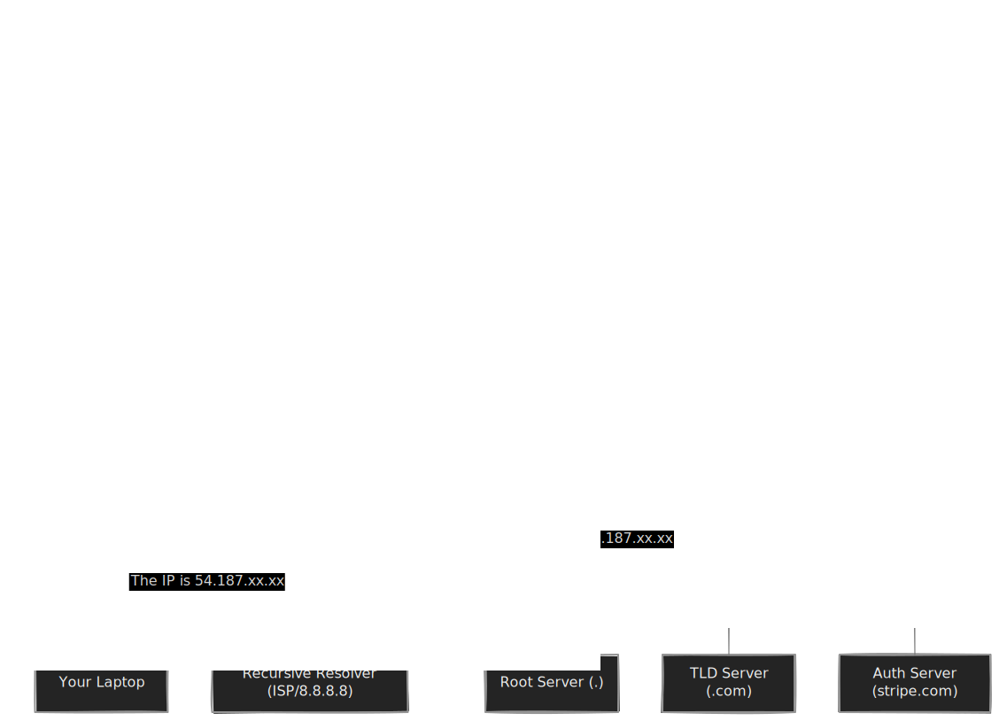

We spent the last module in the basement of the internet. We've looked at the cables, the blinking lights of the routers, and the handshake protocols of TCP. It's dark down there, and frankly, a bit noisy.

Now, we ascend to the penthouse: **Layer 7, the Application Layer**.

This is where your code actually lives. This is where Python scripts, JDBC drivers, and `curl` commands hang out. The physics of electricity and the routing of packets are abstracted away. Here, we deal in human concepts: names, documents, and secure conversations.

## 9.1 DNS 
If you have ever tried to memorize the IP address of your PostgreSQL database—something catchy like `172.31.25.109`—you know why we invented the **Domain Name System (DNS)**. Humans are terrible at remembering sequences of numbers but great at remembering names like `production-db` or `google.com`.

DNS is often described as the "phonebook of the internet." That analogy is helpful, but it implies a static, physical book sitting on a shelf. In reality, DNS is more like a massive, distributed, highly cached game of "Telephone" played by millions of servers simultaneously.

### The Lookup Journey
When your ETL script tries to connect to `api.stripe.com`, your computer doesn't know where that is. It only knows how to route packets to IP addresses. So, before it sends a single byte of data, it has to resolve the name.

It doesn't just ask one central server. That would be a single point of failure for the entire planet. Instead, it follows a hierarchy.



The **Recursive Resolver** does the heavy lifting. It's usually provided by your ISP or a public provider like Google (`8.8.8.8`) or Cloudflare (`1.1.1.1`). It hunts down the answer, caches it, and returns it to you.

#### The Records: A and CNAME
When the answer finally comes back, it comes in a specific record format. As a data engineer, you will primarily deal with two types.

**1. A Record (Address)**

This is the fundamental mapping. "The name `web-server` maps to IP `192.168.1.50`." It connects a label to the actual machine.

**2. CNAME Records (Canonical Name)**

This is an alias. It says, "The name `www.google.com` is actually just `google.com`." It maps a name to *another name*, not an IP.

Think of an **A Record** as a sign on a door that says "Room 101." Think of a **CNAME** as a sign that says, "Go see the receptionist." You have to resolve the CNAME to find the real name, then resolve *that* name to find the IP.

!!! tip "Data Engineering Context: The Cloud Load Balancer Trick"

    In data engineering, you rarely deal with static IPs anymore. AWS RDS instances, Snowflake, and Load Balancers change their underlying IPs constantly during maintenance or scaling events.

    This is why you almost **never** put an IP address in your `.env` file or Airflow connection string. You use the endpoint URL (e.g., `mydb.cluster-xyz.us-east-1.rds.amazonaws.com`).

    Cloud providers use **CNAMEs** heavily here. That massive RDS endpoint likely CNAMEs to an internal AWS load balancer, which eventually resolves to the fleeting IP of the current primary node. If you hardcode the IP, your pipeline breaks the moment AWS fails over your database.

### TTL (Time To Live)
Computers are lazy. If your recursive resolver went through all the trouble of asking the Root, the TLD, and the Authoritative server where `google.com` is, it doesn't want to do it again five milliseconds later.

Every DNS record comes with a TTL (Time to Live). This is a number, in seconds, that tells the resolver, "You can remember this answer for 300 seconds. After that, this data is considered stale, and you must ask me again."

This caching happens at every layer:

1. **Browser/OS Cache**: Your laptop remembers it.
2. **Router Cache**: Your home WiFi router remembers it.
3. **ISP Resolver Cache**: The ISP remembers it.

!!! warning "The 'Host Not Found' Nightmare"

    You trigger a migration of your database to a new server. You update the DNS record to point to the new IP.  You high-five your team.

    Five minutes later, the dashboards are red. Half your ETL jobs are failing with connection timeouts, but *some* are working fine. Why?

    **Propagation Delay (TTL).**

    The machines that are failing are still holding onto the *old* IP address in their local cache because the TTL hasn't expired yet. They are trying to talk to a ghost.

    **Pro-Tip:** Before a major infrastructure migration, lower the TTL of your DNS records to something short (like 60 seconds) a day in advance. This ensures that when you make the switch, the world catches up quickly.

### Debugging DNS
When you see `GenericJDBCException: Host not found` or `Name or service not known`, it means the phonebook lookup failed.

Don't just stare at the logs. Use the tools.

- `nslookup <hostname>`: The basic tool. Asks the default resolver.
- `dig <hostname>`: The power tool. Shows you the TTL, the specific server answering, and the full trace.

If `dig` works on your machine but your Python script fails, check if your script is running inside a Docker container. Docker has its own internal DNS resolver that can sometimes get confused or misconfigured, creating a "split-brain" DNS situation where the container sees a different world than the host.

## 9.2 HTTP & REST
If TCP is the reliable shipping truck, **HTTP (Hypertext Transfer Protocol)** is the standardized shipping form you fill out to tell the warehouse what you want.

At its core, HTTP is astonishingly simple. It is a text-based protocol. If you could type fast enough, you could literally speak HTTP to a server using a raw Telnet session. It is a request-response cycle: you ask for something, and the server replies.

REST (Representational State Transfer) is just a set of "grammatical rules" we agreed to use when speaking HTTP so that our APIs behave predictably.

### The Request: Verbs and Headers
Every HTTP request starts with a **Verb** (the action) and a **Path** (the target).

- **GET**: "Please fetch this resource." (e.g., `GET /user/123`). This should be read-only.
- **POST**: "I am sending you new data to create." (e.g., `POST /orders`). 
- **PUT**: "Replace this existing resource entirely."
- **DELETE**: "Burn it."

Attached to this request are **Headers**. These are the metadata—the address on the envelope.

- `Authorization: Bearer <token>`: The VIP pass that lets you in.
- `Content-Type: application/json`: Tells the server, "I am speaking JSON, not XML."
- `User-Agent`: Tells the server who you are (e.g., "PostmanRuntime" or "MyPythonScript/1.0").

### The Response: Status Codes
The server replies with a payload (the data) and a **Status Code**. As a data engineer building ingestion pipelines, you need to know these codes by heart because they dictate your logic flow.

| Range | Meaning | "Mood" |
|:---|:---|:---|
| 200-299 | Success | "All good. Here is your data." |
| 300-399 | Redirection | "It moved. Go look over there." |
| 400-499 | Client Error | "You messed up. (Bad syntax, bad password)." |
| 500-599 | Server Error | "I messed up. (Database down, NullPointerException)." |

!!! tip "Data Engineering Context: The API Extraction Loop"

    When writing a script to pull data from an API (like Salesforce, Shopify, or Jira), your code usually lives in a `while` loop. The Status Codes are your traffic signals.

    1.  **Pagination:** Most APIs won't give you 1 million rows in one `GET`. They give you 50. You must look for a "Next Page Token" in the response body and loop.
    2.  **Rate Limiting (429):** If you hit the API too fast, you get a `429 Too Many Requests`.
        - *Naive approach:* Crash.
        - *Senior approach:* Implement **Exponential Backoff**. Sleep for 1 second, then retry. If it fails, sleep for 2, then 4, then 8.
    3.  **Idempotency:** If you send a `POST` to create a record and the network cuts out before you get a `200 OK`, did it save? If you retry, do you create a duplicate? This is why `PUT` (idempotent updates) is often safer than `POST` for data pipelines.

## 9.3 TLS/SSL (Encryption)
If you send a standard HTTP request, it travels across the internet in "clear text." Any router, switch, or hacker sitting at a coffee shop running Wireshark between you and the server can read your API keys and your customer's data.

To fix this, we wrap HTTP in a layer of encryption. This gives us **HTTPS**.

The technology powering this is **TLS (Transport Layer Security)**, formerly known as SSL. It solves two problems:

1. **Encryption**: Nobody can read the message.
2. **Identity**: You know you are talking to the real bank.com, not a fake site.

### The Handshake (Public vs. Symmetric Keys)
TLS uses a clever hybrid of mathematics.

- **Asymmetric Encryption (Public/Private Key)**: Very slow, but allows two strangers to share a secret without anyone else seeing it.
- **Symmetric Encryption (Shared Key)**: Very fast, but requires both parties to already know the secret.

The TLS Handshake uses the slow Asymmetric method just long enough to agree on a "Session Key." Once they agree, they switch to the fast Symmetric method for the actual data transfer.


### Certificates and Trust
How does your computer know that the Public Certificate the server sent is actually valid? Your operating system (Windows/Linux/macOS) ships with a pre-installed list of **Root CAs (Certificate Authorities)**. These are trusted entities (like DigiCert or Let's Encrypt). If the server's certificate was signed by one of these trusted authorities, your computer trusts it.

!!! warning "The 'SSLCertVerificationError'" 
    
    You will eventually encounter this error in your Python logs: `requests.exceptions.SSLError: certificate verify failed`.

    This usually happens in corporate environments (Enterprises). To inspect traffic, corporate firewalls often perform a **Man-in-the-Middle (MITM)** attack on their own employees. They intercept your HTTPS request, decrypt it, scan it, re-encrypt it with their *own* internal certificate, and send it to you.

    Since your standard Python installation doesn't know about your company's internal "Custom CA," it thinks you are being hacked and terminates the connection.

    **The Fix:** You need to point your library to the corporate "Certificate Bundle" (a `.pem` file).
    ```python
    # The quick fix for debugging (DO NOT DO THIS IN PROD)
    requests.get('https://internal-api', verify=False)

    # The real fix
    requests.get('https://internal-api', verify='/path/to/corporate-cert-bundle.pem')
    ```

### DE Context: The Cost of Security
Encryption is not free. It requires CPU cycles to encrypt and decrypt every byte.

- **Handshake Overhead**: Establishing an HTTPS connection takes several round-trips (RTT). If your pipeline opens a new connection for every single row you insert, you will spend 90% of your time doing TLS handshakes.
- **Connection Pooling**: This is why database drivers and HTTP clients use "Connection Pooling." They do the expensive handshake once, keep the socket open, and reuse it for thousands of queries.

We have now climbed the entire stack, from the silicon of the CPU to the encrypted API calls of the application layer. But so far, we have mostly talked about one computer.

Modern data engineering is rarely about one computer. It is about clusters. It is about hundreds of machines trying to agree on facts.

## Quiz

<quiz>
In the context of DNS, what is the primary function of a 'CNAME' record compared to an 'A' record?
- [ ] It maps a hostname to an IPv6 address.
- [ ] It specifies the mail server responsible for accepting email messages.
- [x] It aliases one hostname to another hostname.
- [ ] It maps a hostname directly to an IPv4 address.

</quiz>

<quiz>
You migrate a database to a new server and update the DNS. Most systems connect fine, but one legacy ETL server keeps failing with connection timeouts, trying to reach the old IP. What is the most likely culprit?
- [ ] The recursive resolver is down.
- [ ] The Root CA certificates are outdated.
- [x] The TTL (Time to Live) has not expired in the local cache.
- [ ] The new server is rejecting the connection.

</quiz>

<quiz>
When building an API ingestion pipeline, you receive an HTTP 429 status code. What is the correct programmatic response?
- [ ] Immediately retry the request.
- [ ] Log the error as a permanent failure and alert the on-call engineer.
- [ ] Switch from a GET request to a POST request.
- [x] Implement an exponential backoff strategy.

</quiz>

<quiz>
Why is the distinction between POST and PUT important for data pipelines?
- [ ] POST is encrypted, while PUT is sent in clear text.
- [ ] PUT requests are processed faster by the CPU.
- [ ] POST is used for fetching data, while PUT is for sending data.
- [x] PUT is idempotent, meaning retrying the request won't create duplicate records.

</quiz>

<quiz>
In the TLS/SSL Handshake, why is Asymmetric Encryption (public/private key) used only at the beginning?
- [ ] It requires the server to know the client's password.
- [ ] It is less secure than Symmetric Encryption.
- [ ] It cannot encrypt JSON data, only text.
- [x] It is too slow to use for the entire data transfer.

</quiz>

<quiz>
You are running a Python script in a corporate environment and get an `SSLCertVerificationError`. What is the most likely cause?
- [x] Your script does not trust the corporate firewall's self-signed certificate.
- [ ] The API key you provided is invalid.
- [ ] The remote server is down.
- [ ] You are using HTTP instead of HTTPs.

</quiz>

<quiz>
Why do high-throughput database drivers use 'Connection Pooling'?
- [x] To avoid the high CPU and latency cost of the TCP/TLS handshake for every query.
- [ ] To ensure that every query uses a different IP address.
- [ ] To prevent SQL injection attacks.
- [ ] To compress the data being sent over the network.

</quiz>

<quiz>
Which HTTP status code indicates that the server failed to process a valid request due to an internal error (e.g., database crash)?
- [ ] 301
- [ ] 400
- [x] 500
- [ ] 404

</quiz>

<quiz>
What is the role of the 'Recursive Resolver' in a DNS lookup?
- [ ] It encrypts the DNS traffic using HTTPs.
- [x] It acts as a middleman that hunts down the IP by querying the Root, TLD, and Authoritative servers.
- [ ] It assigns domain names to people who buy them.
- [ ] It hosts the actual IP address for the specific domain.

</quiz>

<quiz>
Which command line tool gives you the most detailed information about a DNS lookup, including the specific server answering and the TTL?
- [ ] ping
- [x] dig
- [ ] ssh
- [ ] curl

</quiz>

<!-- mkdocs-quiz results -->