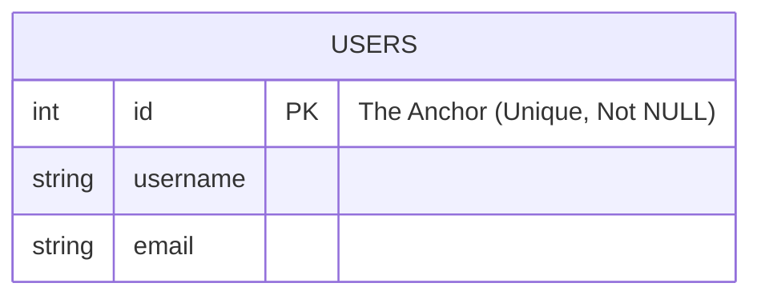

If tables are the canvas and data types are the palette, **constraints** are the laws of physics.

Until now, our database has been a chaotic, anarchic place. We could shove a negative number into a price column. We could create two users with the exact same email address. We could create an order referencing a customer that doesn't exist.

Data without integrity is worse than useless; it is misleading. To build a reliable system, we must enforce rules at the lowest level possible: the database itself. We are going to lock the doors and set strict rules for who (and what), gets to come inside.

## 5.1 Primary Key
Every row needs an identity.

Imagine a table of users. You have two users named "John Smith." If you want to update John's email, how do you tell the database *which* John you mean? If you rely on the name, you update both. If you rely on the email, what happens when they change it?

We need a stable, unchanging anchor for every single row. This is the **Primary Key**.

!!! abstract "The Surrogate vs. The Natural"

    You will often hear a debate about "natural keys" (using data that already exists, like a social security number or email) versus "surrogate keys" (an arbitrary number ID generated by the database).

    In practice, **surrogate keys** usually win. Real-world data is messy. People change emails. Governments change ID formats. An auto-incrementing integer (or a UUID) never changes, never has meaning, and therefore, never breaks.

Here is how we appoint a primary key. By making `id` as the primary key, the database guarantees that no two rows will ever share an ID, and the ID can never be empty (`NULL`).

```sql
CREATE TABLE users (
    id INT PRIMARY KEY,
    username VARCHAR(50),
    email VARCHAR(100)
);

-- (Or, utilizing auto-increment (syntax varies by SQL flavor))
CREATE TABLE users (
    id SERIAL PRIMARY KEY, -- Postgres style
    username VARCHAR(50)
);
```



If you try to insert a user with an ID that already exists, the database won't just ignore you; it will raise an error and abort the transaction. This is the shield that protects your data's identity.

## Foreign Key
Data rarely lives in isolation. An `Order` belongs to a `Customer`. A `Post` belongs to an `Author`.

In the application layer, these are just objects pointing to other objects. But in the flat world of relational databases, we bridge these islands using **Foreign Keys**. A foreign key is a column in one table that points strictly to the **Primary Key** of another table.

It creates a relationship, but more importantly, it enforces **Referential Integrity**.

```sql
CREATE TABLE orders (
    id SERIAL PRIMARY KEY,
    order_date DATE,
    amount DECIMAL(10, 2),
    -- This column points to the users table
    user_id INT
    FOREIGN KEY (user_id) REFERENCES users(id)
);
```

### The Guarantee
The Foreign Key constraint makes a promise: **You cannot point to a ghost.**

1. **Insertion**: You cannot create an order for `user_id = 99` if user 99 does not exist in the `users` table.
2. **Deletion**: You cannot delete user 5 if user 5 still has orders in the `orders` table.

!!! warning "The Cascade"

    Sometimes, you do want to delete the orders when the user is deleted. You can modify the constraint with `ON DELETE CASCADE`. Use this with extreme caution. It is the difference between "I can't delete this user because they have history" and "I deleted this user and silently wiped out 5 years of financial records."

Excalidraw Narrative: The Rope Bridge Imagine two cliffs. On the left cliff is the "Users" table. On the right cliff is the "Orders" table. The Foreign Key is a rope bridge connecting a specific Order on the right to a specific User on the left. The constraint is the physics of the bridge: You cannot anchor the bridge to thin air on the User side. If the User side of the cliff collapses (the row is deleted), the bridge snaps, and the Order falls into the abyss (or the database stops the cliff from collapsing).

## 5.3 Unique
The Primary Key creates a unique identity for the row, usually via a number like `402`. But often, your business logic requires uniqueness on *human-readable* data.

For example, two users can't share the same email address. Two products shouldn't have the same SKU.

The `UNIQUE` constraint enforces this. Unlike the Primary Key, you can have multiple unique constraints on a single table.

```sql
CREATE TABLE products (
    id SERIAL PRIMARY KEY,
    sku VARCHAR(20) UNIQUE,  -- No two products can have the same SKU
    name VARCHAR(100),
    slug VARCHAR(100) UNIQUE -- No two products can have the same URL slug
);
```

If we run the following SQL twice, the second attempt would fail:

```sql
INSERT INTO products (sku, name, slug)
VALUES ('HAMMER-01', 'Heavy Hammer', 'heavy-hammer');
-- Error: Duplicate key value violates unique constraint "products_sku_key"
```

## 5.4 NOT NULL
By default, SQL is very forgiving. If you don't know the value for a column, SQL inserts `NULL`.

`NULL` is not zero, `NULL` is not an empty string. `NULL` is the absence of information. It is a question mark.

While `NULL` is useful, it is a leading cause of bugs in application logic. If your code expects a username string but gets a `NULL`, your application crashes. The `NOT NULL` constraint forbids the question mark.

```sql
CREATE TABLE employees (
    id SERIAL PRIMARY KEY,
    first_name VARCHAR(50) NOT NULL -- Mandatory
    last_name VARCHAR(50) NOT NULL -- Mandatory
    middle_name VARCHAR(50)        -- Optional (Can be NULL)
);
```

!!! note "The Billion Dollar Mistake"

    Tony Hoare, the inventor of the null reference, calls it his "billion-dollar mistake." Using `NOT NULL` liberally forces you to confront missing data at the moment of insertion, rather than having it blow up your analytics dashboard six months later.

## 5.5 CHECK
Finally, we have the most flexible tool in the box. Sometimes *uniqueness* isn't enough. Sometimes you need to validate the *nature* of the data.

- A price cannot be negative.
- A percentage must be between 0 and 100.
- A start date cannot be after an end date.

The `CHECK` constraint allows us to write a small expression that must evaluate to `TRUE` for the data to be accepted.

```sql
CREATE TABLE items (
    id SERIAL PRIMARY KEY,
    name VARCHAR(100) NOT NULL,
    price DECIMAL(10, 2),
    discount_percentage INT,

    -- The Rules
    CONSTRAINT price_must_be_positive CHECK (price >= 0),
    CONSTRAINT discount_valid_range CHECK (discount_percentage BETWEEN 0 AND 100)
);
```

If you try to get clever and pay the user to take the item:

```sql
INSERT INTO items (name, price) VALUES ('Generous Gift', -50.00);
-- Error: new row for relation "items" violates check constraint "price_must_be_positive"
```

## Quiz

<quiz>
What is the primary function of a Primary Key in a relational database?
- [ ] To ensure that data fits a specific format, such as an email address.
- [ ] To link two different tables together.
- [x] To uniquely identify every single row in a table.
- [ ] To allow multiple rows to share the same identifier.

</quiz>

<quiz>
According to the chapter, why are Surrogate Keys (like auto-incrementing integers) often preferred over Natural Keys (like email addresses)?
- [ ] SQL databases cannot use strings as Primary Keys.
- [x] Surrogate keys never change, whereas natural data like emails can change.
- [ ] Surrogate keys are easier for humans to memorize.
- [ ] Natural keys take up too much storage space.

</quiz>

<quiz>
A Foreign Key in one table is strictly designed to point to which column in another table?
- [ ] Any column that has a UNIQUE constraint.
- [ ] The first column defined in the schema.
- [x] The Primary Key.
- [ ] The column with the largest data size.

</quiz>

<quiz>
What guarantee does "Referential Integrity" provide regarding Foreign Keys?
- [ ] It ensures that the Foreign Key is unique in its own table.
- [ ] It automatically creates the referenced row if it is missing.
- [x] You cannot point to a ghost; the referenced row must exist.
- [ ] It guarantees that the foreign key column cannot be NULL

</quiz>

<quiz>
Using `ON DELETE CASCADE` is always the safest way to handle data deletion
- [ ] True
- [x] False

</quiz>

<quiz>
How does a `UNIQUE` constraint differ from a Primary Key?
- [ ] `UNIQUE` allows duplicates, but Primary Key does not.
- [ ] Primary Keys can be `NULL`, but `UNIQUE` columns cannot.
- [ ] There is no functional difference; they are synonyms.
- [x] A table can have multiple `UNIQUE` constraints, but only one Primary Key.

</quiz>

<quiz>
What does the `NOT NULL` constraint explicitly forbid?
- [ ] Duplicate values.
- [x] The absence of information (`NULL`).
- [ ] The number zero.
- [ ] Empty strings.

</quiz>

<quiz>
Which constraint would you use to enforce a rule that a "price" column must be greater than or equal to 0?
- [ ] `NOT NULL`
- [x] `CHECK`
- [ ] `UNIQUE`
- [ ] `FOREIGN KEY`

</quiz>

<quiz>
In SQL, `NULL` is equivalent to the number `0`.
- [ ] True
- [x] False

</quiz>

<quiz>
What happens if you try to insert a row that violates a constraint (e.g., inserting a duplicate primary key)?
- [ ] The database automatically overwrites the old data with the new data.
- [ ] The database accepts the data but marks it as invalid.
- [ ] The database deletes the old row to make room for the new one.
- [x] The database aborts the transaction and raises an error.

</quiz>

<!-- mkdocs-quiz results -->

## Summary
We moved beyond simply defining the shape of our data to strictly enforcing its integrity. We established that a database without rules is merely a digital dumpster, and introduced **constraints** as the gatekeepers of quality. We anchored our rows with **primary keys**, bridged tables with rigid **foreign keys**, and banished ambiguity with **NOT NULL**. By leveraging **UNIQUE** for distinctness and **CHECK** for custom logic, we ensured that our database actively rejects invalid states rather than quietly corrupting them. 

## Labs
Please complete Chapter 5 labs from the companion [GitHub Repository](https://github.com/mckenzie-andrew/odea-labs){target="_blank"}. 