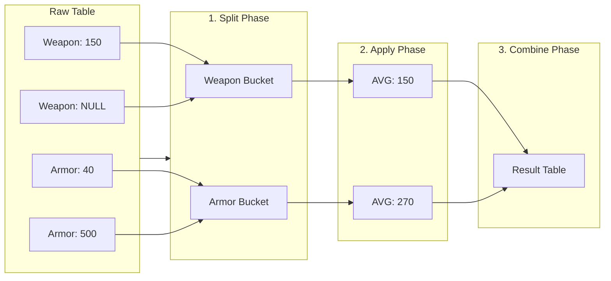

Up until now, our SQL queries have been somewhat myopic. We've been looking at data row by row, examining individual trees while ignoring the forest. We can select a specific spell, filter for items that cost less than ten gold, or list every goblin in the `monsters` table.

But data becomes wisdom when we stop looking at individual records and start looking at *trends*. A shopkeeper doesn't just want to know that a "Iron Sword" costs 50 gold; they want to know the *average* price of their weapons inventory. A guild master doesn't care about the name of every single recruit; they want to know the *count* of active members.

This is the domain of **aggregate queries**. We are moving from retrieval to analysis. We are going to take a pile of rows and squash them down into single, meaningful numbers.

## 6.1 Aggregate Functions
The machinery of aggregation relies on a set of special functions. Unlike scalar functions (like `UPPER()` or `ROUND()`), which transform one input into one output per row, aggregates functions take a vertical slice of your table (a whole column of data) and compress it into a single scalar value.

To explore this, let's assume we are querying an `inventory` table for an RPG shop.

| id | item_name | type | price | weight |
|--|--|--|--|--|
| 1 | Potion of Healing | Consumable | 50 | 0.5 |
| 2 | Iron Sword | Weapon | 150 | 5.0 |
| 3 | Wooden Shield | Armor | 40 | 8.0 |
| 4 | Potion of Mana | Consumable | 60 | 0.5 |
| 5 | Plate Mail | Armor | 500 | 35.0 |
| 6 | Rusty Dagger | Weapon | NULL | 1.0 |

### COUNT
The most fundamental question we can ask is, "How much stuff is there?"

`COUNT` comes in two flavors, and the distinction is subtle but dangerous.

1. `COUNT(*)`: Counts the rows. It doesn't care what is in them. If a rows exists, it gets counted.
2. `COUNT(column_name)`: Counts the *non-null* values in that specific column.

```sql
-- Flavor 1: How many items do we have in total?
SELECT COUNT(*) FROM inventory;

-- Flavor 2: How many items have a price listed?
SELECT COUNT(price) FROM inventory;
-- Result: 5 (The Rusty Dagger has a NULL price, so it is ignored!)
```

!!! warning "The NULL Trap"

    SQL is notoriously slippery when it comes to `NULL`. `COUNT(*)` includes rows with `NULL` values. `COUNT(column)` ignores them. If you are trying to calculate an average manually by doing `SUM / COUNT`, using the wrong count will silently skew your math.

### SUM
This does exactly what it says on the tin. It adds up all the values in a numeric column.

```sql
-- What is the total value of our entire inventory?
SELECT SUM(price) FROM inventory;
-- Result: 800
```

If you try to `SUM` a text column (like `item_name`), SQL will likely yell at you (or worse, return 0).

### AVG
`AVG` calculates the arithmetic mean. It sums the values and divides by the count of *non-null* values.

```sql
-- What is the average price of an item?
SELECT AVG(price) FROM inventory;
-- Result: 160
```

!!! Note "On the above Results"

    The sum is 800. There are 6 items, but only 5 have prices. 800 / 5 = 160. The `NULL` Rusty Dagger was excluded entirely from the calculation. It didn't count as a "zero"; it just didn't exist for the purpose of the average.

### MIN and MAX
These find the extremes. While they are obvious for numbers, they are surprisingly useful for other data types.

- **Numbers**: Lowest/Highest value.
- **Strings**: First/Last alphabetically.
- **Dates**: Earliest/Latest point in time.

```sql
SELECT
    MIN(price) AS cheapest_item,
    MAX(item_name) AS last_alphabetical_item
FROM inventory;
```

## 6.2 Grouping Results
We touched on `GROUP BY` and `HAVING` previously, using the analogy of sorting coins. That is a great mental model for the *action* of grouping. Now, let's look at it through the lens of **scope** and **dimensionality**.

When you run a standard `SELECT`, the "scope" of your query is the individual rows. When you run an aggregate function like `AVG(price)` *without* a group, the scope is the entire table.

`GROUP BY` allows you to define a scope somewhere in the middle. It effectively *reduces* the dimensionality of your table. If you have 1,000 rows, but only 3 unique `type` values, `GROUP BY type` essentially creates a temporary result set with only 3 rows.

### GROUP BY: The "Split-Apply-Combine" Pattern
Data scientists often refer to this workflow as **Split-Apply-Combine**.

1. **Split**: Break the table into buckets based on the `GROUP BY` column (e.g., `type`).
2. **Apply**: Run the aggregate function (e.g., `AVG`) on each bucket individually.
3. **Combine**: Stitch the results back into a single table.



Let's look at the query:

```sql
SELECT type, COUNT(*) AS count, AVG(weight) AS avg_weight
FROM inventory
GROUP BY type;
```

**The Rule of the Group**: Once you invoke `GROUP BY`, your `SELECT` clause enters a strict contract. You can *only* select:

1. The column(s) you are grouping by.
2. Aggregate functions.

If you try to `SELECT item_name` while grouping by `type`, the database will throw an error. Why? Because the "Weapon" group contains both "Iron Sword" and "Rusty Dagger." The database doesn't know which name you want, so it refuses to guess. 

Visualizing the Squash Imagine a trash compactor.

Narrative for Excalidraw: > Draw a 3D translucent box representing the table. Inside, rows are floating layers.

On the left, we see the raw rows: 'Potion' (Red), 'Sword' (Blue), 'Shield' (Green), 'Potion' (Red).

In the middle, an invisible force (gravity?) pulls identical colors together. The Reds stack on top of each other. The Blues stack.

On the right, we see the output: Single thick blocks. A thick Red block labeled "2 Potions", a Blue block, a Green block. The key takeaway: The individual details (like the specific ID of the potion) are crushed inside the block. We can only see the label (color/type) and the mass (aggregates).

### HAVING: Filtering the Aggregates
If `WHERE` is the bouncer at the door of the club, deciding who gets in, `HAVING` is the VIP manager deciding who gets bottle service once they are already seated.

We previously mentioned that `HAVING` filters after grouping. Let's dig into *why* that matters computationally.

The database engine cannot filter on a value *that hasn't been calculated yet*.

```sql
-- ❌ THIS WILL FAIL
SELECT type, AVG(price)
FROM inventory
WHERE AVG(price) > 100
GROUP BY type;
```

This fails because `WHERE` runs during the row-scanning phase. At that moment, the database is looking at the "Iron Sword." It doesn't know what the *average* price of Weapons is yet. It hasn't finished scanning the table!

We must let the database finish the **Split-Apply-Combine** cycle first. Only then, once we have the calculated averages, can we discard the groups we don't want.

```sql
-- ✅ THIS WORKS
SELECT type, AVG(price)
FROM inventory
GROUP BY type
HAVING AVG(price) > 100;
```

**The Logical Flow**
1. `FROM inventory`: Open the box.
2. `WHERE`: Throw out specific garbage items (if any).
3. `GROUP BY type`: Sort items into piles.
4. `SELECT AVG(price)`: Calculate the statistics for each pile.
5. `HAVING`: Kick over the piles that are too small or too cheap.
6. `ORDER BY`: Arrange the remaining piles nicely.

### Multiple Aggregates
You aren't limited to one metric. A truly powerful aggregate query paints a complete picture of the group.

```sql
SELECT
    type,
    COUNT(*) AS total_items,
    MIN(price) AS cheapest_option,
    MAX(price) AS luxury_option,
    AVG(weight) AS average_heft
FROM inventory
GROUP BY type
HAVING COUNT(*) > 1;
```

This query tells a story, "Show me the market statistics for every category of item, but ignore the unique, one-off categories."

## Quiz

<quiz>
Which of the following statements about `COUNT(*)` versus `COUNT(column_name)` is true?
- [ ] `COUNT(*)` ignores `NULL` values, while `COUNT(column_name)` counts everything.
- [x] `COUNT(*)` counts all rows including `NULL`s, while `COUNT(column_name)` ignores `NULL`s in that column.
- [ ] Both functions behave exactly the same way.
- [ ] `COUNT(*)` is only used for text columns, while `COUNT(column_name)` is for numbers.

</quiz>

<quiz>
The `AVG()` function calculates the average by treating `NULL` values as zero.
- [ ] True
- [x] False

</quiz>

<quiz>
Which SQL clause is strictly required if you want to filter results based on an *aggregate* value (like `AVG(damage) > 50`)?
- [ ] `GROUP BY`
- [x] `HAVING`
- [ ] `WHERE`
- [ ] `ORDER BY`

</quiz>

<quiz>
You want to find the alphabetical last name in a list of students. Which function should you use?
- [ ] `COUNT()`
- [ ] `LAST()`
- [x] `MAX()`
- [ ] `SUM()`

</quiz>

<quiz>
Identify the error in this query: `SELECT type, item_name, AVG(price) FROM inventory GROUP BY type;`
- [x] You cannot select `item_name` because it is not in the `GROUP BY` clause and is not aggregated.
- [ ] The `GROUP BY` clause should come before `FROM`.
- [ ] You cannot use `AVG` with `GROUP BY`.
- [ ] There is no error.

</quiz>

<quiz>
What is the correct logical order of execution for a query containing these clauses?
- [ ] `GROUP BY` --> `HAVING` --> `WHERE`
- [ ] `HAVING` --> `WHERE` --> `GROUP BY`
- [ ] `GROUP BY` --> `WHERE` --> `HAVING`
- [x] `WHERE` --> `GROUP BY` --> `HAVING`

</quiz>

<quiz>
What does the "Split" phase in the **Split-Apply-Combine** pattern correspond to in SQL?
- [ ] The `ORDER BY` clause.
- [ ] The `WHERE` clause.
- [ ] The `SELECT` clause.
- [x] The `GROUP BY` clause.

</quiz>

<quiz>
If you run `SELECT SUM(price) FROM inventory` and the inventory is empty (0 rows), what is the result?
- [ ] Undefined
- [ ] 0
- [x] NULL
- [ ] An error message

Aggregate functions (except `COUNT`) generally return `NULL` if the input set is empty or contains only `NULL`s.
</quiz>

<quiz>
You can use multiple aggregate functions (like `MIN`, `MAX`, and `AVG`) in the same `SELECT` statement.
- [x] True
- [ ] False

</quiz>

<quiz>
Why does the query `SELECT type, AVG(price) FROM inventory WHERE AVG(price) > 100 GROUP BY type;` fail?
- [x] Because `AVG(price)` hasn't been calculated when `WHERE` runs.
- [ ] Because you cannot group by `type`.
- [ ] Because `AVG` requires a `HAVING` clause even if `GROUP BY` is missing.
- [ ] Because 100 is not a valid price.

</quiz>

<!-- mkdocs-quiz results -->

## Summary
In this chapter, we shifted our focus from retrieving individual rows to analyzing trend across datasets using **aggregate functions**. We explored how `COUNT`, `SUM`, `AVG`, `MIN`, and `MAX` alow us to distill large columns of data into single, meaningful values, while noting th dangerous behavior of `NULL` in calculations.

## Lab
Please complete Chapter 6 labs from the companion [GitHub Repository](https://github.com/mckenzie-andrew/odea-labs){target="_blank"}. 